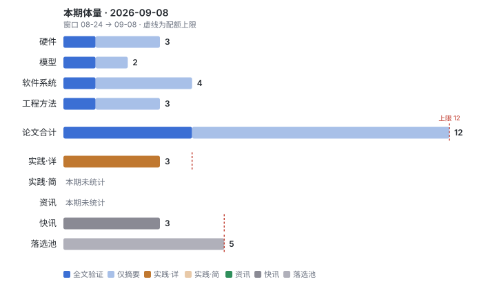
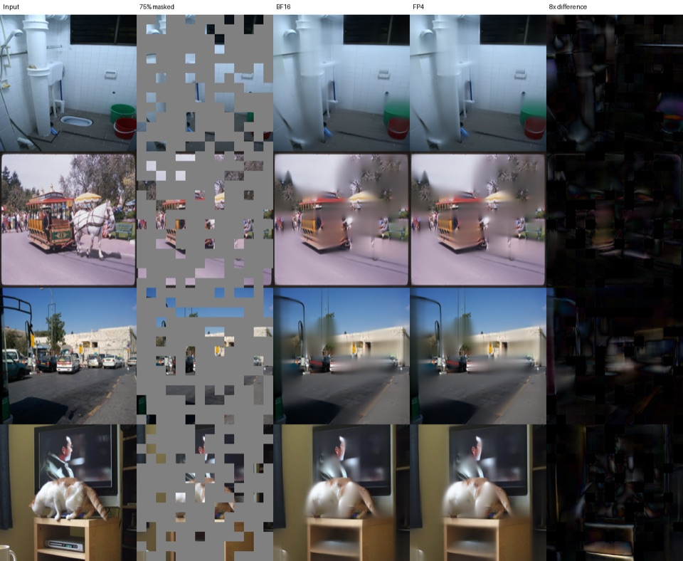
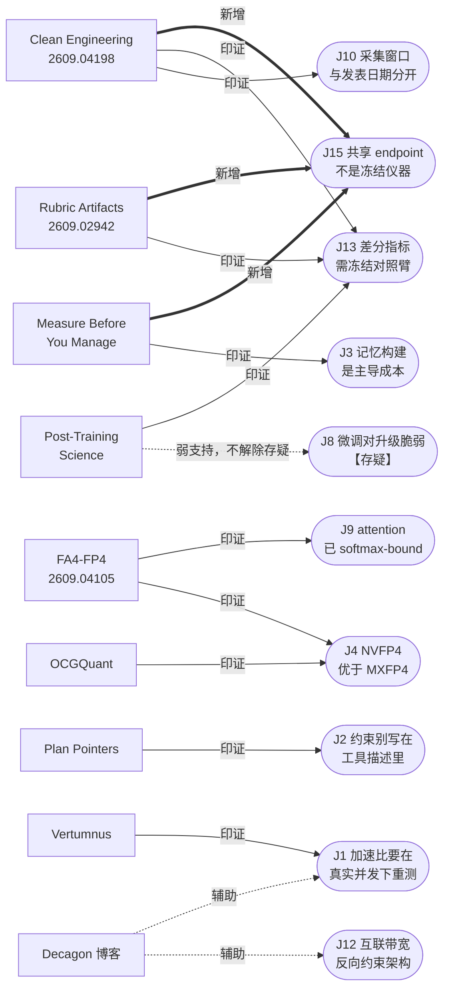
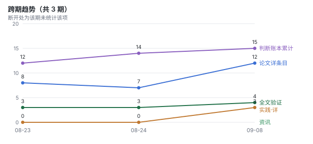

# 论文雷达 · 2026-09-08（窗口：08-24 → 09-08）

本周论文扩容至 12 篇。窗口 15 天超过 10 天（硬规则 8 第 2 条），跨了 8 月末和 9 月初两批 arXiv。工程实践 3 条、快讯 3 条、落选池 5 条，都在原配额内。

本次走了 exa：四条线各 2–3 个角度用 `web_search_exa`，非论文单独一轮，首推用 `web_fetch_exa` 拉全文。覆盖面无打折。

---

## 本周只读一篇

**Clean Engineering, Unstable Measurement: A Preregistered Reliability Failure of Black-Box LLM Observers on Shared Endpoints** · 谢菲尔德大学 + Ranplan Wireless / Cambridge AI+ · 2026-09-03 · [arXiv 2609.04198](https://arxiv.org/abs/2609.04198) · 【论文】【全文】

**为什么是它**：本窗口唯一一篇把「LLM judge 能不能当仪器用」做成预注册、可终止研究线的门来测的论文。它自己被这个门挡死了两次。

两轮预注册战役，阈值全部事先冻结，两轮都没通过仪器验证阶段。同窗口重复的排序一致性 Spearman **0.400**，要求是 0.90；逐字节相同输入隔日重放的一致性 **0.78**，要求是 0.99。与此同时投递率、schema 合法性、请求体哈希、记录的 metadata 字段全部满格。工程记录挑不出毛病，预注册判据判仪器不可用。

三条机制解释这个落差。标签到语义的映射对读数的偏置强度与信号本身相当。候选之间的分差比仪器自身的噪声底低七个数量级。逐字节相同的输入会返回不同排序，而 exact-permutation 这种读数会把这类噪声放大。

两条自然的逃生路都被堵死。换指标没用。靠采样量堆也没用：一个 748,000 次调用的模拟设计，500 次里过了 0 次。

预注册的追加实验把边界钉死了。**等一天没用**，同日 0.805 对跨日 0.800，又复现了五天。**换厂商没用**，三个司法辖区的四家 provider 共享同一个噪声底，中位数 0.74–0.88，他们暴露的 metadata 字段没有一个能预测稳定性，`system_fingerprint` 在三种模式下都失效。**自建加 batch-invariant kernel 只在服务器空闲时有用**，并发负载一上来分歧度涨 **8.4 倍**，回到共享 endpoint 的量级。最后是在已知分差的人造错误上，这个读数的区分度跟错误类型走，不跟错误大小走。

**全文验证发现**：

1. **预印本时间线**：v1，2026-09-03 首次提交，无历史版本，不是旧作换壳。
2. **数据采集窗口 vs 发表**：论文自己先把这刀砍了。52,988 次「审计请求尝试」是审计量，不是样本量。真正的分析建立在 31 个有效任务组、100 对重放、每条补充臂 10 个窗口、3,060 次人造错误判定上。看到五位数就以为统计功效很足，是错的读法。
3. **代码仓库状态**：append-only 审计链，每个数字可解析到 SHA-256 钉死的归档成员，排除的窗口全部披露。但我没能核到一个公开可访问的仓库地址，可复现性目前只算论文内自洽，不是外部可复跑。
4. **基线公平性**：0.90 和 0.99 这两个门是作者自己预注册的，不是社区标准。严格程度由作者定，别把「过不了 0.90」直接读成「judge 全线不可用」。真正硬的证据是那些相对量：8.4 倍的并发劣化、四家 provider 共享噪声底、区分度跟错误类型走。
5. **适用边界（最重要的一条）**：作者在 §11.2 明说这个任务族制造了自己的最坏情况，候选分差比噪声底低七个数量级，再加 exact-permutation 读数放大。如果你的 judge 是粗粒度分类（好/坏、通过/不通过）而不是对近似并列候选做精细排序，退化不会这么剧烈。可迁移的是纪律，不是那两个数字：先量噪声底和分差分布，再跑判据的操作特征曲线，最后才冻阈值。作者自己算过，用本研究约 **2%** 的调用量做个 pilot，就能提前暴露这两个够不着的门。

**谁该读**：所有用 LLM 当评委的人，不管是刷 leaderboard、筛训练数据，还是在 CI 里拿模型判断做 gate。特别是在共享 API endpoint 上跑评测、并把结论写进决策的团队，这篇给了一份必须先做的 pilot 清单。

---

## 硬件（只收论文）

**Hardware-Aware FP4 FlashAttention-4** · Graphcore Research 技术报告（单作者 Robert Hu） · 2026-09-03 · [arXiv 2609.04105](https://arxiv.org/abs/2609.04105) · 【论文】【全文】

把 J9（Blackwell 上 attention 变 softmax/SMEM-bound）的根因从「softmax 慢」收窄到一个具体的存储所有权问题。SM100 与实测的 SM103 路径只暴露 **512 个逻辑 TMEM 列**，D128 下一个 FP32 score tile 或 output 累加器各吃 128 列。两个 score bank 加两个 output bank 正好吃满整个配额，第三个 query stage 没有落脚点。所以调度问题不是 barrier 信号不够：barrier 能报告存储空了，但造不出另一个目的地。

方法 Direct-P 把归一化后的分数直接映射成 MXFP4 概率码，并对 PV 实际消费的那批已舍入的值做归一化。GB200 上前向吞吐最高 **2.13× BF16**。因果路径把前向的量化状态（量化后的 Q/K、scale、softmax 归一化因子）直接传给反向，用 FP8 梯度操作数，单卡 8B 完整一次更新最高 **1.14×**。

训练侧的负面结论比加速比更值钱：匹配的分布式训练必须保留 FP8 的 probability 和 value，因为每一条测过的 MXFP4 P/V 训练轨迹都发散。

*Figure 5，出自 [arXiv 2609.04105](https://arxiv.org/abs/2609.04105)，CC BY 4.0。四组 ViT-MAE 例子，左起：输入、75% 掩码、BF16 重建、FP4 重建、8 倍放大的差值。只有 encoder attention 在两条路径间不同。差值图放大八倍后仍接近全黑，是「推理侧 FP4 attention 可用」这个结论的直观证据，跟上面训练侧发散的结论正好形成对照。*

**全文验证发现**：① v1 首投，非重投。② 它继承的是 HAO AI Lab 的两 query 调度，自己的贡献只是 score→P 这一段，别当成一个全新 kernel。③ 作者自己两次收窄口径：「full FP4」只指 attention 的四个操作数，不是整个 transformer；2.13× 限定在 favorable Blackwell shapes；学习到的 projection 仍是独立精度边界，所以这不是纯 FP4 端到端训练。④ 复现材料声称在附录 E，我没有核实仓库的实际状态与活跃度。⑤ 硬件边界是 GB200 / SM100 / SM103，B300 在报告焦点里出现过。单作者自评，无第三方复现。

**谁该读**：写 attention kernel 的、在做 Blackwell 采购论证的，以及任何准备在训练里上 MXFP4 的人。最后这条直接劝退。

---

**TrainSDC: Characterizing and Mitigating Silent Data Corruption in Large Language Model Training** · 2026-08-31 · [arXiv 2608.30769](https://arxiv.org/abs/2608.30769) · 【论文】【仅摘要】

首个按计算界面系统刻画 Transformer 训练 SDC 脆弱性的工作，前向反向都覆盖。两条错误传播机制截然不同：前向脆弱性高度依赖位置，Q/K 路径上的故障会产生持续的训练偏移；反向脆弱性基本由梯度指数分布决定，跟计算位置关系不大。据此给出 Q/K 路径重算、残差增益监控、指数感知的梯度缩放，运行时开销 **1.65%–6.76%**。

水分：只在 Llama 3.2-1B 和 Qwen3-0.6B 上做故障注入。是注入不是生产坏卡，跟账本里 SDCs in the Wild、AEGIS 那类生产数据不是一回事。它补的是「为什么某些位置更致命」的机制，不是「生产里长什么样」。

**谁该读**：自建训练集群、已经在做 SDC 防护的团队。这篇告诉你保护预算该往哪儿倾斜，别再均匀保护了。

---

**OCGQuant: Outlier-Companion Grouping for NVFP4 Quantization** · EMNLP 2026 Main · 2026-08-30 · [arXiv 2609.00066](https://arxiv.org/abs/2609.00066) · 【论文】【仅摘要】

给 NVFP4 的 block scale 被离群值主导这件事起了个名字并直接治。定义 **Collateral Quantization Error**：同一 block 里其余值因为 scale 被最大值定死而多吃的、本可消除的那部分误差。然后用 Outlier-Companion Grouping 自适应地把离群通道跟低幅值通道配对，改善 block 组成。Llama3 和 Qwen3 上 WikiText-2 困惑度最低、下游平均准确率最高，prefill 加速接近 RTN，峰值解码显存与 RTN 持平，所以它不是拿速度换精度。

水分：只报困惑度和下游平均准确率，没有多步推理或 agent 类任务。J1 里 QSpec 那条教训是，缺多步任务的基准会系统性高估量化方案。

**谁该读**：准备在 Blackwell 上把激活也量到 NVFP4 的人。

---

## 模型（只收论文）

**Post-Training Science for Supervised Fine-Tuning** · Baseten · 2026-09-01 · [arXiv 2609.01244](https://arxiv.org/abs/2609.01244) · 【论文】【全文】

一次把 SFT 的整条决策链放在同一台仪器上扫。每次只动一个杠杆，跨 Qwen3（0.6B–32B）和 Llama 3.1/3.2 两个 family、四个真实客户数据集、LoRA 与全量微调两条臂。1,008 个计划 cell 里 970 个合格，被剔的全是 LoRA 在最高学习率 3e-3 的 run。可以直接抄的结论：

- **LoRA 最优学习率在 0.6B–32B 两个 family 上是平的 1e-3**，约为全量微调最优值的 33 倍。拟合出的幂律指数在两个 family 里都与 0 统计上无法区分。这条规则原封不动迁移到了留出的 30B MoE：那个 MoE 微调起来像个中位 8.5B 的稠密模型，三个 MoE 都落在其激活参数量与总参数量的几何平均处。
- **rank 到 64 就到顶，α=32 在每个 cell 里都是最好的 scale**，所以 r=64/α=32 这个默认值站得住。rank 32 是更便宜的档，最多只让出 0.003 nats。
- **验证 loss 只在同一个 (模型, 数据集, 配方) cell 内可信**，标准化后 Spearman −0.38 到 −0.88，跨 family 不可迁移。用 Fisher trace 度量的极小点平坦度在 loss 匹配时不提供任何额外可靠信息。
- **过约 2 轮 epoch 验证 loss 就开始过拟合**，而被判定的任务质量并不再提升，IFEval 上的通用指令跟随反而退化。加新数据能降 loss，但不会把最优 epoch 上限推过 2。
- Muon 只把预训练优势带进来很窄的一条：学习率约为 AdamW 的 1/3 时验证 NLL 略低、极小点更平，判定质量打平，但通用指令跟随保留得更好。

关键图见原文 Figure 2（跨 family 的选择规则迁移矩阵）。这篇是 arXiv 非独占许可，不转载，按硬规则 13 只给链接。

**全文验证发现**：① v1 首投。② 四个客户数据集是匿名的、不公开（security / leasing / support / docs），外部无法复跑，这是最大的可复现性缺口。③ 有一个必须自己算进去的循环：训练数据是用迭代式 SFT「改到通过评测为止」生成的，而下游打分用的就是这套数据被造出来所要满足的那个 judge。作者把它当优点写（监督目标内部一致、无标签噪声），但代价是生成器与评判器同源，「判定质量不随 epoch 提升」这类结论在这个设置下天然偏保守。④ 基线：LoRA 学习率法则承接 Thinking Machines Lab (2025) 的单尺度结果并把它扫到多尺度多 family，属于诚实扩展。⑤ 边界：模型阶梯到 235B 总参，每个 cell 只训 5,000 条一个 epoch，硬件未在正文披露。

**谁该读**：任何还在为每个新模型、新数据集重扫一遍学习率的人，这篇直接省掉那次扫描。做 MoE 微调的可以直接用几何平均那条定位起点。

---

**Modern Transformers Are Implicit Hybrids: From Functional Differentiation to Principled Hybrid Architecture Design** · 2026-09-02 · [arXiv 2609.02986](https://arxiv.org/abs/2609.02986) · 【论文】【仅摘要】

混合注意力的层与头分配一直是启发式的，这篇想给它找个证据基础。提出两个干预式指标：RFIS 量每个频率对某个 head 注意力分布的影响，RPD 隔离出对旋转位置调制的依赖。RFIS 提出假说、RPD 做验证，在 Qwen3 系列和 Llama3.1 上得到一套完整的检索头与位置头分类，二者被一条显著的中低频带隔开。受控 Transformer 显示这条边界跟随训练长度的位置尺度，作者称之为 Global Positional Band。

由此给出两条原则：位置建模只应在局部做，全局访问走位置无关的检索；这两种功能应在头粒度分配、按层定制。实例化为 HwH（全局检索用 NoPE 全注意力、局部位置建模用线性注意力），**FA:LA 低于 1:3** 仍保持语言建模与常识推理能力。

水分：仅摘要级。分类学建立在 Qwen3 和 Llama3.1 上。「零样本长度外推失败的一个可能成因」是作者措辞谨慎的推测，不是证明。与账本里 HydraHead（头粒度是自然粒度）方向一致，可以对读。

**谁该读**：在评估混合线性注意力路线的人，以及在做长上下文外推排障的人。

---

## 软件系统（只收论文）

**Measure Before You Manage: Evaluating Agent Working Memory in Coding Agents** · Argonne National Lab + Columbia + 休斯顿大学（AgenticOS workshop） · 2026-08-31 · [arXiv 2608.31057](https://arxiv.org/abs/2608.31057) · 【论文】【全文】

结论不是哪个记忆策略赢，而是在把收益归因给任何记忆管理策略之前，你必须先量什么。跨 55 条归档的编码 agent 轨迹做类型化对象记账（instructions / artifacts / tool outputs / agent state），发现语义不同的工作记忆对象在留存与压缩行为上确实分化。然后拿两个语义感知策略（对象感知压缩、检索式）当案例做验证，得到两条硬结论：**标定期的收益不一定迁移到留出任务**；**名义 token 预算相等，不代表送达上下文相等，也不代表管理成本相等**。真实系统重放还暴露出光看名义预算看不到的服务侧限制。最后收敛成四层评估框架：stored state → delivered context → management work → task/process outcome。

**全文验证发现**（这篇的诚实度值得单独说）：① v1 首投，workshop 论文不是主会。② 证据很薄，且作者自己标了红线。表 1 明写「这些样本不得相加当作独立复现」。策略标定只用 15 个 SymPy 任务，留出只有 8 个任务（5 个仓库），检索追加实验复用的是开发集任务，不构成第二个留出集。③ 评测不是官方 SWE-bench：本地 Docker-free 评测器只检查 FAIL_TO_PASS 加前 20 个 PASS_TO_PASS，后来那 48 个完整 task–arm cell 压根没有有效的形式化修复评测。主要终点被明确降级为一个 level-4 过程指标（重复工具调用次数），作者自己说它量的是过程规整度而非修复成功。④ 它自己撞上了本周只读一篇的那个坑并如实披露：记录的模型别名是 claude-opus-4.8，但 served revision 是未钉死的，辅助请求省略了 temperature，所以作者拒绝声称确定性解码，也拒绝声称完全无人值守的工作流。⑤ 边界：25 步上限，8 个仓库，SWE-bench Lite 派生。

**谁该读**：所有在做 agent 上下文压缩或记忆管理、并准备拿「省了 X% token」汇报的人。这篇告诉你那个数字在四层里只占一层，另外三层可能反着走。

---

**Adaptive Context Parallelism for Production LLM Serving (Vertumnus)** · 2026-09-04 · [arXiv 2609.04774](https://arxiv.org/abs/2609.04774) · 【论文】【仅摘要】

现有支持上下文并行（CP）的服务系统要么用静态 CP 配置，要么只对活跃请求或批次调 CP 度。Vertumnus 两层都动。请求级用「预测排队延迟 + 缓存感知 prefill 时间 + GPU 时间成本」合成的放置代价，把请求路由到不同 CP 度的 worker。集群级用秒级的 split 和 merge 随负载调整 worker 构成。再加一个全局 prefix-cache 管理策略，在请求分配和 worker 构成变化时保住缓存局部性，含跨不同 CP 度 worker 的放置与复制。64 卡集群加公开与生产混合负载，**在评测过的最高负载下**平均 TTFT 最多降 28.1%、token 加权 SLO 达成率最多 +13.3pp，对比的是最强基线。

水分：仅摘要级。「最高负载下」这个限定词是作者自己加的，正是 J1 说的低负载测不出配置差异。64 卡规模，互联未披露，J12 的老问题照旧：不知道它假设的是什么网络。

**谁该读**：自建长上下文推理服务、已经在跑 CP 的团队。

---

**Plan Pointers and Record-Directive Form in Budgeted Verification of Inherited Agent Memory** · 2026-09-03 · [arXiv 2609.03450](https://arxiv.org/abs/2609.03450) · 【论文】【仅摘要】

十二项预注册研究、14,760 次尝试，问一个很窄但很实的问题：一个 agent 继承了六条一行记忆、行动前最多只能取回一条归档原始记录时，记忆库里写的「指示」以什么形式呈现，决定它去取哪一条。

结果不客气。六个直连厂商模型上，长度匹配的「判据」比裸 id 高 **35.0 点**，区间 [+31.2, +38.8]。但同一对比在九模型 OpenRouter 面板上没通过预注册的优越性判据。最刺眼的一条是在判据后面追加那个 id 会把判据完全抵消，三个 Claude 模型上都成立，**Opus 5 从 40/40 掉到 0/40**。六处逐字节编辑显示每个精确字符串都有自己的效果。加一行批准语（Opus 5 上 +96.0 点）配两个额度的预算能把目标救回来。跨五种判据措辞，这个后缀的抵消在 Opus 5 上四比五成立，在 Fable 5.1 上五比五成立。所有材料在首次确证调用前就已冻结、打时间戳并外部存档（Zenodo）。

水分：仅摘要级。作者自己声明全部是「精确编辑在固定面板上的描述性效应」，不做机制主张。结论绑死在一条 instrument lineage 上，换个记忆库（Study H1）所有模型就都跟随判据了。所以别把 35 点当常数搬走，要搬的是记忆和指令的措辞与拼接顺序是一等变量、且效应会跨模型翻转这件事本身。

**谁该读**：写 agent 记忆 schema 的、在项目文件或 skill 里排指令优先级的，以及任何在拼 prompt 时随手把 id 附在描述后面的人。

---

**KVMem: Virtualizing Million-Token Agent Workspaces on a Consumer GPU** · 2026-09-04 · [arXiv 2609.04852](https://arxiv.org/abs/2609.04852) · 【论文】【仅摘要】

不压缩也不重新 prefill。把溢出的工作区历史当作分页 KV 状态，保留在 GPU 显存、主机内存、NVMe 三层，用轻量的、模型原生的注意力空间索引挑相关历史块，物化一个受模型原生上下文窗口约束的、依查询而定的执行视图。LongMemEval、MemoryAgentBench、AgentLongBench 上（历史长到 100 万 token）普遍优于压缩式方案。DeepSWE 长上下文测试用 Qwen3.8-27B，任务成功率从纯压缩的 43.8% 升到 **48.4%**。本地部署那组用 Qwen3.6/3.8-27B NVFP4 加 MTP，跑在一台配 24GB RTX 5090 笔记本 GPU 的现成笔记本上，虚拟化最高 100 万 token 工作区（模型原生窗口 256K 的四倍），单会话 50 tokens/s。

水分：仅摘要级。「generally achieves higher」是作者自己的模糊措辞，没给逐基准的完整表。50 tokens/s 是单会话数字，多会话和并发未提。

**谁该读**：做本地或私有化部署长时程 agent 的人，以及被「压缩还是检索」这个二选一卡住的人。这篇给了第三个选项。

---

## 工程方法（只收论文）

**Clean Engineering, Unstable Measurement** · [arXiv 2609.04198](https://arxiv.org/abs/2609.04198) · 【论文】【全文】

即上文「本周只读一篇」，本线第一名，详见开头。

---

**Judging LLM-as-a-Judge: Concerning Rubric Artifacts in LLM-based Automated Text Generation Evaluation** · EMNLP 2026 · 2026-08-31 · [arXiv 2609.02942](https://arxiv.org/abs/2609.02942) · 【论文】【仅摘要】

LLM-as-a-Judge 的前提是判定来自对候选回答按 rubric 推理。这篇给这个前提捅了两刀。**只用 rubric 文本训练、完全看不到被评回答的分类器，就能对 judge 的输出取得非平凡的预测性能**，也就是 rubric 的措辞本身编码了可回收的评价信号，分数可以在不看模型输出的情况下被部分预知。另一刀是反事实扰动下，把候选回答或 rubric 判据反转，judge 常常不可靠地不更新它的决定。

水分：仅摘要级。5 页短文（EMNLP 2026 接收），没给「非平凡」的具体数值区间。与账本里 No Judgment Without a Reason（保义置换把 98% 打回 55%）机制同族，可以直接对读。

**谁该读**：所有在用 rubric 驱动 LLM 评委的人。先拿「只喂 rubric 不喂回答」跑一遍你自己的判据，这是成本极低的探针。

---

**Does task decomposition improve automatic NLG evaluation?** · EMNLP 2026 · 2026-09-01 · [arXiv 2609.01139](https://arxiv.org/abs/2609.01139) · 【论文】【仅摘要】

一条干净的负面结果。既有工作靠把评估任务拆成更简单的子任务来改进 LLM-as-a-judge。这篇在多个 NLG 数据集上系统对比拆解与不拆解，**找不到任何证据表明拆解带来性能提升**。此前报告的收益来自把人类标注当训练数据用，而不是拆解本身。附带一条：有人类标注可用时，不做拆解的 LLMaJ 就能与人类标注者打平。

水分：仅摘要级。限于 NLG 评估任务族，不能直接外推到 agent 轨迹评判或代码正确性判定。

**谁该读**：正准备给自己的评委加一层「分维度打分再聚合」的人。先确认你的收益不是来自那批人类标注。

---

## 工程实践（非论文）

**本周值得一读的实践：Feedly「Fast autoscaling on GPUs」**。它把一个人人都在报的单一数字（冷启动 15 分钟）拆成三个成因不同的阶段，并且如实写下了那个做反了的改动。这比任何一个加速比都更可复用。

---

**Fast autoscaling on GPUs** · Feedly（作者 Jash Dalvi） · 2026-09-02 · [原文](https://feedly.com/engineering/posts/fast-autoscaling-on-gpus) · 【工业博客】

自建翻译服务的 GPU 冷启动从 **15m21s 降到 5m50s**。方法上唯一重要的一步是先拆阶段再动手：image pull 等网络、imports 等 CPU、replica init 里先下权重再编译（两件事混在一起）。拆完瓶颈立刻清楚，光 image pull 就占 15 分钟里的 **10 分钟**，容器带着 CUDA、PyTorch、vLLM 超过 20GB。

开 GKE Image Streaming 把「先下完再启动」反转成「打开文件时才取」，image pull 基本消失，冷启动降到 8m19s。但省下来的没有拿掉的那么多：imports 和 replica init 都变长了，因为那些字节还是得到，只是挪到了后面。之后权重从 Hugging Face 挪到同区 GCS（吞吐约翻倍），`torch.compile` 缓存改成预先构建一次随权重下发（省约 1 分钟 replica init），`VLLM_MEMORY_PROFILER_ESTIMATE_CUDAGRAPHS=0` 跳过那个跑两分钟却只为两秒录制服务、且估高了近四倍的显存估算（engine init 大致减半，省下的显存直接进 KV cache）。

**核验发现的水分**：① 第一方，写自家服务，无产品推销。② 有一条难得的负面数据。他们先试过把权重和编译缓存烤进镜像，结果在 streaming 下镜像里的文件并不是本地的，同样走网络：同一份 3.8 GiB checkpoint，镜像层 93 MB/s、bucket 56 MB/s、HF 约一半。但镜像压缩后大了 3.2GB，为省 28 秒的权重读付出了 52 秒的 imports，净亏，最后拆掉了。这种改动方向做反了的记录是本条最值钱的部分。③ 缺上下文：全文没写 GPU 型号、没写模型名称与规模、没写副本数与 QPS。所以 15m21s→5m50s 这个绝对值不可跨环境搬运，可搬的是阶段拆分方法和那三个具体开关。④ 版本未钉死：`VLLM_MEMORY_PROFILER_ESTIMATE_CUDAGRAPHS` 没标 vLLM 版本，作者自己说过度预留是个已知问题。上游一旦修掉，这个开关的名字和收益都会变，抄之前先核当前版本。

**谁该读**：任何在 Kubernetes 上按需扩容 GPU 推理的人，以及任何准备把模型烤进镜像的人（先看第 ② 条）。

---

**How we made one of our largest inference workloads 4.7× more GPU-efficient** · Decagon（作者 Nick Liu） · 2026-09-03 · [原文](https://decagon.ai/blog/gpu-efficient-inference-serving-stack) · 【工业博客】

批量、对单请求延迟不敏感的调度型推理负载，在完整扩容生命周期（启动、空闲、稳态、排空队列）上口径统一地计 GPU-hour，总体少用约 80% 的 GPU-hour，折合 **4.7× 的 fleet 级 GPU 效率**。三个改动：PD 分离、突发流量的准入控制、缩短新容量变得可用的时间。

方法层面有三条可直接抄。**PD 拓扑要按流量选**：prompt 重的用 2P:1D、生成重的用 1P:2D，按哪一相限制吞吐来定，然后把这个 P/D 拓扑当一个单元一起扩容。**把队列挪到 GPU 容器前面**：一个轻量准入控制器跟踪每个容器的排队与在途工作量、限制各容器接新活、其余留在共享队列里。这样单容器并发仍高到能有效攒批，多出来的请求仍可被重新分配到新起来的容量上。naive 自动扩容的问题是突发已经被钉死在最早那几个容器的引擎内部队列里，新容量帮不上忙。第三条是在构建容器时和 worker 启动时都验证快路径。

**核验发现的水分**（这条比上一条大得多）：① 第一方，但文末带招聘 CTA 和客户证言，是带营销动机的载体。收它是因为方法可独立复现，不是因为那个数字。② 4.7× 不可归因。他们同时换了更高显存的 GPU 并做了三项软件改动，而全文没有 GPU 型号、没有模型名称与规模、没有基线配置、没有并发数、没有绝对的 tokens/GPU-hour。这个数字里有多少是硬件升级买的，读者无从判断。③ 引擎未点名（推测 vLLM 或 SGLang 一类，但没写），版本未钉死。④ 真正硬的是两条负面观察，且它们与账本相互印证：最早的几次分离部署并没有快多少，有些更大的配置反而更慢（PD 分离的收益要盖过那次大块数据传输才成立）；以及一次构建静默地从预期的节点内 NVLink 传输回退到了 TCP，因为缺了必要的运行时支持，系统照样工作但通信成了瓶颈。

**谁该读**：跑批量或离线推理、并在为 PD 分离做决策的人，以及所有假设「配了 NVLink 就一定走 NVLink」的人。

---

**Serving LLMs on Tenstorrent Hardware: Inside the vLLM TT Plugin** · vLLM 团队 · 2026-09-07 · [原文](https://vllm.ai/blog/2026-09-07-vllm-tt-plugin) · 【一方博客】【上游变更】

以 vLLM 的 out-of-tree 平台插件机制接入 Tenstorrent 加速器。核心内容不是多了个后端，而是一次关于插件接口够不够通用的实证：TT 设备跟 GPU 长得很不一样，但相位受限的调度器、不同的数据并行拓扑、部分跑在设备上的采样路径，全部在 vLLM core 之外表达出来了。

三条结构性差异值得读。① 没有 TP/PP rank 可配。Galaxy 上的 70B 不是 32 个进程的 TP，而是一个为 32 芯片 mesh 编译的程序，`MESH_DEVICE=TG` 取代 `--tensor-parallel-size`，插件直接拒绝 `-tp` 和 `-pp` 而不是假装遵守。② 调度步只能是 prefill-only、decode-only 或 empty，没有混合批。chunked prefill 在这个约束下仍支持，长 prompt 拆成多个 prefill 步，中间插 decode-only 步。③ 采样可以在设备上完成，host 看不到 logits，需要 host 侧采样能力的请求逐批回退。

**核验发现的水分**：① 第一方，vLLM 官方博客写自家插件机制，非转述。② 零性能数字。原文明说手工调优带来更好的 tokens/$，但这里不引用数字，当前数据在 tenstorrent.com 和 GitHub。所以这条只能当设计文档读，不能当性能证据引用。③ 版本时效是本条最实用的信息：安装当前需要在 tt-metal 环境里从源码构建 **vLLM 0.26.0**，而 vLLM 主线在 2026-08-26 已到 **v0.28.0**，插件落后主线两个 minor 版本。作者自称 validate against a pinned vLLM release，正在加宽这个窗口。同时给了一份诚实的限制清单：投机解码、LoRA、prompt logprobs 均不支持（后者在请求校验阶段直接拒绝），prefix caching 仅对声明支持的模型开启，标准多进程 DP 不支持 MoE，多机服务尚未支持。④ 营销动机存在（新后端发布），但给了可复现的接入方法（entry point、config 字段、环境变量、README 指向），故保留为详条目。

**谁该读**：在评估非 NVIDIA 推理硬件的人，以及任何想给 vLLM 写自己硬件后端、想知道能不能不 fork 的人。

---

## 快讯（≤5 条）

- Qwen3.8-2.4T-A95B 开源（2.4T 参数 / 95B 激活 / 512 专家），vLLM day-0 支持并在 NVIDIA 与 AMD 上验证，两家各出一份现成 4-bit checkpoint：NVFP4 1.32 TiB 跑单台 8×B300、MXFP4 1.45 TiB 跑单台 8×MI355X，无需转换与校准 · @vllm_project · [原帖](https://x.com/vllm_project/status/2087571359413281049)
- 重新审视「离谱地小」的神经网络：4.91B token 的训练里损失始终未饱和，块路由 MoE（E=128）在 259M token（约九小时）时开始学到东西；把激活参数塞进 L2 cache，Intel Emerald Rapids CPU + AMX 上跑到 14,572 tok/s（发布者自己强调这是实验，别当生产模型） · @GregoryDiamos · [原帖](https://x.com/GregoryDiamos/status/2096873745420075020)
- 一篇把推理效率的硬件路线拆成两个维度（把权重搬进 SRAM，或放弃通用灵活性换硅效率）并给 Cerebras / Groq / Etched / Google Frozen v2 定位的长文 · @BSPK_ · [原帖](https://x.com/BSPK_/status/2096582455860015508)

（快讯只作信号，不作证据，不进两个账本。硬规则 11。）

---

## 落选池（≤5 条）

- **ContextPipe: Database-Inspired Context Assembly for Long-Horizon Agents** · 把上下文装配类比成关系数据库的查询执行（Plan-Bind-Optimize-Execute-Feedback 五段加 EXPLAIN ANALYZE 轨迹），总 token 降 31%、LLM 调用降 23%、响应时间降 9%，但代价是 KV cache 命中率下降，且只在 SWE-bench Pro 的 Qutebrowser 子集上做了初步评估 · [arXiv 2609.00749](https://arxiv.org/abs/2609.00749)
- **Behaviorally Effective LoRA Writes Are Sparse and Structured** · 有行为效果的 LoRA 写入远比低秩参数化暗示的更集中（per-module top-k 最优在 k∈{2,4}，晚层 q_proj/o_proj/down_proj 少数方向影响超大），机制上漂亮但离「今天该怎么调」还有距离 · [arXiv 2609.01374](https://arxiv.org/abs/2609.01374)
- **HBQ: Hierarchical Scaling Block Quantization** · 用大 block 加新的 significand 二级缩放，W4A5 达到 W4A16 级精度且硅面积小于 NVFP4，配 28nm ASIC 实现。自研加速器团队的菜，租卡买卡团队用不上 · [arXiv 2609.00450](https://arxiv.org/abs/2609.00450)
- **Bilevel Coordinated Reflection: A Game-Theoretic Approach to Multi-Agent LLM Systems** · 理论部分扎实（含「只观察生成轨迹的 gate 无法一致改进」的不可能性结果，与 J6 的「验证者必须独立」同向），但实验只有 500 条 SWE-bench 上 72.2% 对参考 70.8%，增量在噪声内 · [arXiv 2609.02750](https://arxiv.org/abs/2609.02750)
- **InferenceX 官方预览：TPUv7 Ironwood vs Blackwell/Blackwell Ultra** · SemiAnalysis 报告 TPU 在 FP8 聚合服务上性能每美元最高优 50%、TPUv7 无原生 FP4，信息量很大。但基于仍在私有 beta 的 TorchTPU 栈与他们自己的 fork，当前外部不可独立复现（预计 10 月中开源后才可能），且是其付费产品的预览稿，按硬规则 10 第 4 条降级 · [原文](https://newsletter.semianalysis.com/p/tpu-inferencex-full-steam)

---

## 判断账本动态

本周新增 1 条、印证 8 条、无新增存疑。

**新增 J15：在共享 endpoint 上，同一个模型名不是一个冻结的仪器。任何把模型判断当 gate 的评测，必须先测仪器再冻阈值。**

三篇独立论文指向同一结论。Clean Engineering 是主证据：52,988 次审计请求，四家 provider 共享噪声底，自建 batch-invariant kernel 在并发下劣化 8.4 倍回到共享 endpoint 量级，`system_fingerprint` 三种模式下都不预测稳定性。Measure Before You Manage 独立撞上同一问题并披露：记录了模型别名但 served revision 未钉死，因此拒绝声称确定性解码。Judging LLM-as-a-Judge Rubric Artifacts 补上：反事实扰动下 judge 常不更新决定。

与 J13 的关系必须写清。J13 说差分指标要配冻结对照臂，J15 说在共享 endpoint 上那个冻结对照臂本身可能不冻结。J15 是对 J13 解法前提的攻击，两条并存不合并。

**印证（追加证据或精化边界）**：

- **J9**：FA4-FP4 把根因从 softmax-bound 收窄到 TMEM 512 逻辑列被两个 score bank 加两个 output bank 吃满、无处安放第三个 query stage 的存储所有权问题。
- **J4**：FA4-FP4 追加训练侧证据，每条测过的 MXFP4 P/V 训练轨迹都发散，分布式训练只能留 FP8 P/V。边界从「限 attention 推理量化」扩到「训练侧比推理侧更严」。OCGQuant 从机制侧印证 NVFP4 block scale 被离群值主导是真问题。
- **J13**：追加 Clean Engineering、Rubric Artifacts 两篇。另记一条同族污染新样本：Post-Training Science 的训练数据由迭代 SFT 改到通过评测生成，而下游打分用的就是同一个判据。
- **J10**：Clean Engineering 作为预注册负面结果的样板追加。
- **J2**：Plan Pointers 追加「指示的形式与拼接顺序是一等变量」，含 Opus 5 上追加 id 把判据从 40/40 抵消到 0/40 的极端例。
- **J3**：Measure Before You Manage 追加边界，预算记账必须分四层，名义 token 预算相等不代表送达上下文与管理成本相等。
- **J1**：Vertumnus 印证，收益只在「评测过的最高负载下」成立。Decagon 博客作辅助证据，首批 PD 分离部署不快、更大配置反而更慢。
- **J12**：Decagon 的「静默从 NVLink 回退到 TCP」作辅助证据（工业博客）。
- **J8【存疑】**：Post-Training Science 提供弱支持但不改状态。LoRA 最优学习率法则跨 0.6B–32B 两个 family 平坦、且原封迁移到留出的 30B MoE，说明微调配方本身的可迁移性比预期好，方向上支持「数据绑定的能力不脆弱」这一收窄。但它没测升级跳，不足以解除存疑。

