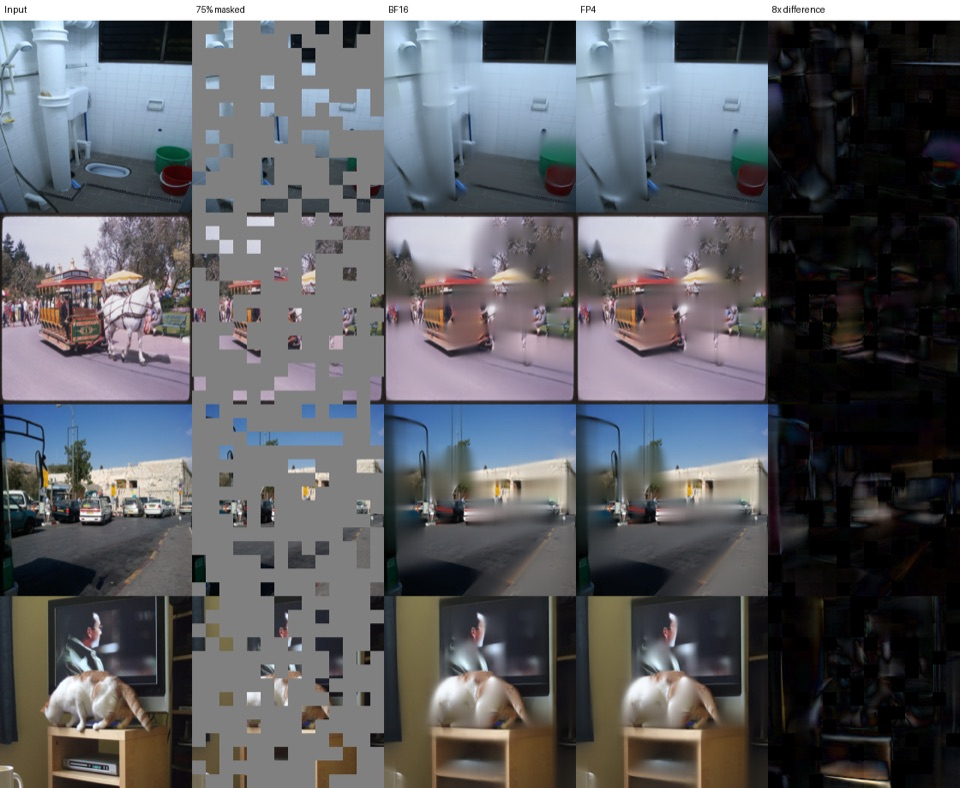

# 评委还没校准，优化已经开始了

Clean Engineering 把评委当测量仪器检验，结果两轮预注册实验都没通过作者预设的可靠性门槛。请求记录完整、格式合法、输入相同，仍然不足以保证读数稳定。对接近并列的候选做精细排序时，评委自己的噪声会压过模型之间的差别。

这个问题也出现在本期的 SFT 与 Agent 记忆研究中。验证 loss 的改善需要核对任务质量，名义 token 预算需要核对实际送达模型的上下文。工程博客再补上部署侧的成本：拉镜像、初始化引擎、排队和通信回退，都会决定一次优化在完整运行周期中是否省钱。

## 评委读数的噪声，可能大于候选之间的差距

对近似并列的结果做精细排序之前，需要知道评委能否稳定重放。下面三篇论文分别检查服务噪声、评分规则和任务拆解。

### 共享端点上的精细排序有多稳定

Clean Engineering, Unstable Measurement: A Preregistered Reliability Failure of Black-Box LLM Observers on Shared Endpoints · 谢菲尔德大学 + Ranplan Wireless / Cambridge AI+ · 2026-09-03 · [arXiv 2609.04198](https://arxiv.org/abs/2609.04198)

这组材料中唯一一篇把「LLM judge 能不能当仪器用」做成预注册、可终止研究线的门来测的论文。两轮实验都未通过该判据。

两轮预注册战役，阈值全部事先冻结，两轮都没通过仪器验证阶段。同窗口重复的排序一致性 Spearman **0.400**，要求是 0.90；逐字节相同输入隔日重放的一致性 **0.78**，要求是 0.99。与此同时投递率、schema 合法性、请求体哈希、记录的 metadata 字段全部满格。工程记录挑不出毛病，预注册判据判仪器不可用。

三条机制解释这个落差。标签到语义的映射对读数的偏置强度与信号本身相当。候选之间的分差比仪器自身的噪声底低七个数量级。逐字节相同的输入会返回不同排序，而 exact-permutation 这种读数会把这类噪声放大。

作者也检查了更换指标与增加样本量。换指标没用。靠采样量堆也没用：一个 748,000 次调用的模拟设计，500 次里过了 0 次。

预注册的追加实验把边界钉死了。等一天没用，同日 0.805 对跨日 0.800，又复现了五天。换厂商没用，三个司法辖区的四家 provider 共享同一个噪声底，中位数 0.74–0.88，他们暴露的 metadata 字段没有一个能预测稳定性，`system_fingerprint` 在三种模式下都失效。自建加 batch-invariant kernel 只在服务器空闲时有用，并发负载一上来分歧度涨 **8.4 倍**，回到共享 endpoint 的量级。最后是在已知分差的人造错误上，这个读数的区分度跟错误类型走，不跟错误大小走。

作者设定的 0.90 与 0.99 是预注册门槛，并非通用标准。任务刻意选择近似并列候选，exact-permutation 读数又会放大变化，所以不能从失败推到所有粗粒度 judge 都不可用。52,988 次审计尝试也不能当作独立样本数；主要分析只有 31 个有效任务组、100 对重放。

### 评分规则本身也会改变判断

Judging LLM-as-a-Judge: Concerning Rubric Artifacts in LLM-based Automated Text Generation Evaluation · EMNLP 2026 · 2026-08-31 · [arXiv 2609.02942](https://arxiv.org/abs/2609.02942) · 摘要导读

LLM-as-a-Judge 的前提是判定来自对候选回答按 rubric 推理。这篇给这个前提捅了两刀。只用 rubric 文本训练、完全看不到被评回答的分类器，就能对 judge 的输出取得非平凡的预测性能，也就是 rubric 的措辞本身编码了可回收的评价信号，分数可以在不看模型输出的情况下被部分预知。另一刀是反事实扰动下，把候选回答或 rubric 判据反转，judge 常常不可靠地不更新它的决定。

摘要尚未回答的部分是：5 页短文（EMNLP 2026 接收），没给「非平凡」的具体数值区间。与 No Judgment Without a Reason（保义置换把 98% 打回 55%）机制同族，可以直接对读。

### 拆开任务后，自动评价一定更好吗

Does task decomposition improve automatic NLG evaluation? · EMNLP 2026 · 2026-09-01 · [arXiv 2609.01139](https://arxiv.org/abs/2609.01139) · 摘要导读

一条干净的负面结果。既有工作靠把评估任务拆成更简单的子任务来改进 LLM-as-a-judge。这篇在多个 NLG 数据集上系统对比拆解与不拆解，找不到任何证据表明拆解带来性能提升。此前报告的收益来自把人类标注当训练数据用，而不是拆解本身。附带一条：有人类标注可用时，不做拆解的 LLMaJ 就能与人类标注者打平。

摘要尚未回答的部分是：限于 NLG 评估任务族，不能直接外推到 agent 轨迹评判或代码正确性判定。

### 从 batch invariance 理解重复性

Thinking Machines Lab / Horace He · 2025-09-10 · [博客原文](https://thinkingmachines.ai/blog/defeating-nondeterminism-in-llm-inference/)

文章从浮点加法顺序讲到 batch invariance：同一 kernel 在相同输入上可以逐位重现，但请求的批次形状变了，归约路径也可能变化。服务端的并发负载决定批大小，用户端便会看到不同输出。这里要区分“同一程序重复运行”与“请求换一个批次仍得到同样结果”。

这份作者侧解释适合和本期的测量研究对读。固定随机种子与贪心解码覆盖不了批次变化；核查一次回归时，还需要记录服务并发和 kernel 路径。博客中的具体实现与实验属于其发表时的版本，不据此保证现在任意推理服务的确定性。

## 训练与低精度的收益，需要跨过任务质量这一关

训练 loss、量化误差和硬件吞吐各有测量对象。参数选择是否可迁移、训练能否稳定，仍要回到相应的任务和设备。

### SFT 配方可以迁移多远

Post-Training Science for Supervised Fine-Tuning · Baseten · 2026-09-01 · [arXiv 2609.01244](https://arxiv.org/abs/2609.01244)

一次把 SFT 的整条决策链放在同一台仪器上扫。每次只动一个杠杆，跨 Qwen3（0.6B–32B）和 Llama 3.1/3.2 两个 family、四个真实客户数据集、LoRA 与全量微调两条臂。1,008 个计划 cell 里 970 个合格，被剔的全是 LoRA 在最高学习率 3e-3 的 run。几项具体观察是：

- **LoRA 最优学习率在 0.6B–32B 两个 family 上是平的 1e-3**，约为全量微调最优值的 33 倍。拟合出的幂律指数在两个 family 里都与 0 统计上无法区分。这条规则原封不动迁移到了留出的 30B MoE：那个 MoE 微调起来像个中位 8.5B 的稠密模型，三个 MoE 都落在其激活参数量与总参数量的几何平均处。
- **rank 到 64 就到顶，α=32 在每个 cell 里都是最好的 scale**，所以 r=64/α=32 这个默认值站得住。rank 32 是更便宜的档，最多只让出 0.003 nats。
- 验证 loss 只在同一个 (模型, 数据集, 配方) cell 内可信，标准化后 Spearman −0.38 到 −0.88，跨 family 不可迁移。用 Fisher trace 度量的极小点平坦度在 loss 匹配时不提供任何额外可靠信息。
- **过约 2 轮 epoch 验证 loss 就开始过拟合**，而被判定的任务质量并不再提升，IFEval 上的通用指令跟随反而退化。加新数据能降 loss，但不会把最优 epoch 上限推过 2。
- Muon 只把预训练优势带进来很窄的一条：学习率约为 AdamW 的 1/3 时验证 NLL 略低、极小点更平，判定质量打平，但通用指令跟随保留得更好。

原文 Figure 2 给出了跨模型家族的选择规则迁移矩阵，可以直接查看哪些参数关系在换模型后仍成立。

四个客户数据集没有公开，且训练样本的生成与下游 judge 使用同一套评价目标，外部复跑和独立评价都有缺口。论文的配方可作为参数扫描起点，不保证在新的任务分布上仍是最优。

### FP4 attention 的前向收益与训练代价

Hardware-Aware FP4 FlashAttention-4 · Graphcore Research 技术报告（单作者 Robert Hu） · 2026-09-03 · [arXiv 2609.04105](https://arxiv.org/abs/2609.04105)

把 Blackwell attention 的 softmax/SMEM 瓶颈从「softmax 慢」收窄到一个具体的存储所有权问题。SM100 与实测的 SM103 路径只暴露 **512 个逻辑 TMEM 列**，D128 下一个 FP32 score tile 或 output 累加器各吃 128 列。两个 score bank 加两个 output bank 正好吃满整个配额，第三个 query stage 没有落脚点。所以调度问题不是 barrier 信号不够：barrier 能报告存储空了，但造不出另一个目的地。

方法 Direct-P 把归一化后的分数直接映射成 MXFP4 概率码，并对 PV 实际消费的那批已舍入的值做归一化。GB200 上前向吞吐最高 **2.13× BF16**。因果路径把前向的量化状态（量化后的 Q/K、scale、softmax 归一化因子）直接传给反向，用 FP8 梯度操作数，单卡 8B 完整一次更新最高 **1.14×**。

训练侧的负面结论比加速比更值钱：匹配的分布式训练必须保留 FP8 的 probability 和 value，因为每一条测过的 MXFP4 P/V 训练轨迹都发散。

*Figure 5，出自 [arXiv 2609.04105](https://arxiv.org/abs/2609.04105)，CC BY 4.0。四组 ViT-MAE 例子，左起：输入、75% 掩码、BF16 重建、FP4 重建、8 倍放大的差值。只有 encoder attention 在两条路径间不同。差值图放大八倍后仍接近全黑，是「推理侧 FP4 attention 可用」这个结论的直观证据，跟上面训练侧发散的结论正好形成对照。*

硬件边界是 GB200 / SM100 / SM103，2.13× 来自有利形状。文中的 full FP4 指 attention 的操作数，不能理解为整个 transformer 的纯 FP4 训练。

### 离群值怎样影响同一 block 中的其他数

OCGQuant: Outlier-Companion Grouping for NVFP4 Quantization · EMNLP 2026 Main · 2026-08-30 · [arXiv 2609.00066](https://arxiv.org/abs/2609.00066) · 摘要导读

给 NVFP4 的 block scale 被离群值主导这件事起了个名字并直接治。定义 Collateral Quantization Error：同一 block 里其余值因为 scale 被最大值定死而多吃的、本可消除的那部分误差。然后用 Outlier-Companion Grouping 自适应地把离群通道跟低幅值通道配对，改善 block 组成。Llama3 和 Qwen3 上 WikiText-2 困惑度最低、下游平均准确率最高，prefill 加速接近 RTN，峰值解码显存与 RTN 持平，所以它不是拿速度换精度。

只报困惑度和下游平均准确率，没有多步推理或 agent 类任务。QSpec 的观察提示，缺多步任务的基准会系统性高估量化方案。

### 训练静默错误沿什么路径传播

TrainSDC: Characterizing and Mitigating Silent Data Corruption in Large Language Model Training · 2026-08-31 · [arXiv 2608.30769](https://arxiv.org/abs/2608.30769) · 摘要导读

作者提出的按计算界面系统刻画 Transformer 训练 SDC 脆弱性的工作，前向反向都覆盖。两条错误传播机制截然不同：前向脆弱性高度依赖位置，Q/K 路径上的故障会产生持续的训练偏移；反向脆弱性基本由梯度指数分布决定，跟计算位置关系不大。据此给出 Q/K 路径重算、残差增益监控、指数感知的梯度缩放，运行时开销 **1.65%–6.76%**。

只在 Llama 3.2-1B 和 Qwen3-0.6B 上做故障注入。是注入不是生产坏卡，与 SDCs in the Wild、AEGIS 的生产数据有不同的观察范围。它补的是「为什么某些位置更致命」的机制，不是「生产里长什么样」。

### 混合注意力的头与层怎样分工

Modern Transformers Are Implicit Hybrids: From Functional Differentiation to Principled Hybrid Architecture Design · 2026-09-02 · [arXiv 2609.02986](https://arxiv.org/abs/2609.02986) · 摘要导读

混合注意力的层与头分配一直是启发式的，这篇想给它找个证据基础。提出两个干预式指标：RFIS 量每个频率对某个 head 注意力分布的影响，RPD 隔离出对旋转位置调制的依赖。RFIS 提出假说、RPD 做验证，在 Qwen3 系列和 Llama3.1 上得到一套完整的检索头与位置头分类，二者被一条显著的中低频带隔开。受控 Transformer 显示这条边界跟随训练长度的位置尺度，作者称之为 Global Positional Band。

由此给出两条原则：位置建模只应在局部做，全局访问走位置无关的检索；这两种功能应在头粒度分配、按层定制。实例化为 HwH（全局检索用 NoPE 全注意力、局部位置建模用线性注意力），**FA:LA 低于 1:3** 仍保持语言建模与常识推理能力。

摘要尚未回答的部分是：分类学建立在 Qwen3 和 Llama3.1 上。「零样本长度外推失败的一个可能成因」是作者措辞谨慎的推测，不是证明。与 HydraHead（头粒度是自然粒度）方向一致，可以对读。

## 记忆成本沿着写入、送达和使用继续累积

存进数据库的 token 与模型最终看到的 token 不相等。工作记忆的统计、检索入口和 GPU 上的放置需要分别观察。

### 工作记忆的四层评估

Measure Before You Manage: Evaluating Agent Working Memory in Coding Agents · Argonne National Lab + Columbia + 休斯顿大学（AgenticOS workshop） · 2026-08-31 · [arXiv 2608.31057](https://arxiv.org/abs/2608.31057)

论文先定义归因所需的测量层级，再比较记忆管理策略。跨 55 条归档的编码 agent 轨迹做类型化对象记账（instructions / artifacts / tool outputs / agent state），发现语义不同的工作记忆对象在留存与压缩行为上确实分化。然后拿两个语义感知策略（对象感知压缩、检索式）当案例做验证，得到两条硬结论：标定期的收益不一定迁移到留出任务；名义 token 预算相等，不代表送达上下文相等，也不代表管理成本相等。真实系统重放还暴露出光看名义预算看不到的服务侧限制。最后收敛成四层评估框架：stored state → delivered context → management work → task/process outcome。

策略标定只有 15 个 SymPy 任务，留出只有 8 个任务；部分完整 task–arm cell 没有正式修复成功率。论文将主要终点收窄为重复工具调用等过程指标，不能据此宣称修复成功率提升。

### 记忆的写法影响 Agent 先查哪条证据

Plan Pointers and Record-Directive Form in Budgeted Verification of Inherited Agent Memory · 2026-09-03 · [arXiv 2609.03450](https://arxiv.org/abs/2609.03450) · 摘要导读

十二项预注册研究、14,760 次尝试，问一个很窄但很实的问题：一个 agent 继承了六条一行记忆、行动前最多只能取回一条归档原始记录时，记忆库里写的「指示」以什么形式呈现，决定它去取哪一条。

结果不客气。六个直连厂商模型上，长度匹配的「判据」比裸 id 高 **35.0 点**，区间 [+31.2, +38.8]。但同一对比在九模型 OpenRouter 面板上没通过预注册的优越性判据。最刺眼的一条是在判据后面追加那个 id 会把判据完全抵消，三个 Claude 模型上都成立，**Opus 5 从 40/40 掉到 0/40**。六处逐字节编辑显示每个精确字符串都有自己的效果。加一行批准语（Opus 5 上 +96.0 点）配两个额度的预算能把目标救回来。跨五种判据措辞，这个后缀的抵消在 Opus 5 上四比五成立，在 Fable 5.1 上五比五成立。所有材料在首次确证调用前就已冻结、打时间戳并外部存档（Zenodo）。

摘要尚未回答的部分是：作者自己声明全部是「精确编辑在固定面板上的描述性效应」，不做机制主张。结论绑死在一条 instrument lineage 上，换个记忆库（Study H1）所有模型就都跟随判据了。所以别把 35 点当常数搬走，要搬的是记忆和指令的措辞与拼接顺序是一等变量、且效应会跨模型翻转这件事本身。

### 百万 token 工作区需要怎样的存储路径

KVMem: Virtualizing Million-Token Agent Workspaces on a Consumer GPU · 2026-09-04 · [arXiv 2609.04852](https://arxiv.org/abs/2609.04852) · 摘要导读

不压缩也不重新 prefill。把溢出的工作区历史当作分页 KV 状态，保留在 GPU 显存、主机内存、NVMe 三层，用轻量的、模型原生的注意力空间索引挑相关历史块，物化一个受模型原生上下文窗口约束的、依查询而定的执行视图。LongMemEval、MemoryAgentBench、AgentLongBench 上（历史长到 100 万 token）普遍优于压缩式方案。

DeepSWE 长上下文测试用 Qwen3.8-27B，任务成功率从纯压缩的 43.8% 升到 **48.4%**。本地部署那组用 Qwen3.6/3.8-27B NVFP4 加 MTP，跑在一台配 24GB RTX 5090 笔记本 GPU 的现成笔记本上，虚拟化最高 100 万 token 工作区（模型原生窗口 256K 的四倍），单会话 50 tokens/s。

摘要尚未回答的部分是：「generally achieves higher」是作者自己的模糊措辞，没给逐基准的完整表。50 tokens/s 是单会话数字，多会话和并发未提。

### Vertumnus：请求放置与集群组成一起调整

Adaptive Context Parallelism for Production LLM Serving (Vertumnus) · 2026-09-04 · [arXiv 2609.04774](https://arxiv.org/abs/2609.04774) · 摘要导读

现有支持上下文并行（CP）的服务系统要么用静态 CP 配置，要么只对活跃请求或批次调 CP 度。Vertumnus 两层都动。请求级用「预测排队延迟 + 缓存感知 prefill 时间 + GPU 时间成本」合成的放置代价，把请求路由到不同 CP 度的 worker。集群级用秒级的 split 和 merge 随负载调整 worker 构成。再加一个全局 prefix-cache 管理策略，在请求分配和 worker 构成变化时保住缓存局部性，含跨不同 CP 度 worker 的放置与复制。64 卡集群加公开与生产混合负载，在评测过的最高负载下平均 TTFT 最多降 28.1%、token 加权 SLO 达成率最多 +13.3pp，对比的是最强基线。

摘要尚未回答的部分是：「最高负载下」这个限定词是作者自己加的，正是 已有研究讨论的低负载测不出配置差异。64 卡规模，互联未披露，这里仍有一个缺口：不知道它假设的是什么网络。

### 按需读取让原始记录保留回来的机会

Anthropic · 2025-09-29 · [博客原文](https://www.anthropic.com/engineering/effective-context-engineering-for-ai-agents)

这篇文章把上下文管理落到工具返回、按需加载、压缩和持久笔记。按需加载让 Agent 先持有文件路径等轻量标识，等需要时再读取内容；压缩则保留架构决定、未解决问题和实现细节，减少重复工具输出。

压缩删掉的信息可能在后续步骤重新变得有用，因此保留一段摘要还不够，还要考虑原始记录能否重新读取。这与本期记忆材料的关系是方法上的对照：博客讲实现选择，论文检查选择后的任务损失。它没有为任意记忆系统提供统一的压缩比例或成功率保证。

## 工程博客里的时间，花在了哪些阶段

推理服务从扩容到稳态之间有很长一段路径。Feedly 和 Decagon 的复盘展示了阶段拆分的价值，Tenstorrent 插件则展示了硬件改变后接口需要表达的约束。

### Feedly：冷启动从 15 分钟缩到 6 分钟以内

Fast autoscaling on GPUs · Feedly（作者 Jash Dalvi） · 2026-09-02 · [原文](https://feedly.com/engineering/posts/fast-autoscaling-on-gpus)

自建翻译服务的 GPU 冷启动从 **15m21s 降到 5m50s**。方法上唯一重要的一步是先拆阶段再动手：image pull 等网络、imports 等 CPU、replica init 里先下权重再编译（两件事混在一起）。拆完瓶颈立刻清楚，光 image pull 就占 15 分钟里的 **10 分钟**，容器带着 CUDA、PyTorch、vLLM 超过 20GB。

开 GKE Image Streaming 把「先下完再启动」反转成「打开文件时才取」，image pull 基本消失，冷启动降到 8m19s。但省下来的没有拿掉的那么多：imports 和 replica init 都变长了，因为那些字节还是得到，只是挪到了后面。之后权重从 Hugging Face 挪到同区 GCS（吞吐约翻倍），`torch.compile` 缓存改成预先构建一次随权重下发（省约 1 分钟 replica init），`VLLM_MEMORY_PROFILER_ESTIMATE_CUDAGRAPHS=0` 跳过那个跑两分钟却只为两秒录制服务、且估高了近四倍的显存估算（engine init 大致减半，省下的显存直接进 KV cache）。

复盘里的一次失败同样有用：把权重和编译缓存烤进镜像后，流式镜像里的文件仍经网络加载。为省 28 秒权重读取增加了 52 秒 imports，最后撤回。全文没有披露 GPU、模型与 QPS，所以绝对启动时间不宜跨环境照搬。

### Decagon：把启动、空闲与排空一起计入成本

Decagon（作者 Nick Liu） · 2026-09-03 · [原文](https://decagon.ai/blog/gpu-efficient-inference-serving-stack)

批量、对单请求延迟不敏感的调度型推理负载，在完整扩容生命周期（启动、空闲、稳态、排空队列）上口径统一地计 GPU-hour，总体少用约 80% 的 GPU-hour，折合 **4.7× 的 fleet 级 GPU 效率**。三个改动：PD 分离、突发流量的准入控制、缩短新容量变得可用的时间。

方法层面有三条可以作为起点。PD 拓扑要按流量选：prompt 重的用 2P:1D、生成重的用 1P:2D，按哪一相限制吞吐来定，然后把这个 P/D 拓扑当一个单元一起扩容。把队列挪到 GPU 容器前面：一个轻量准入控制器跟踪每个容器的排队与在途工作量、限制各容器接新活、其余留在共享队列里。这样单容器并发仍高到能有效攒批，多出来的请求仍可被重新分配到新起来的容量上。naive 自动扩容的问题是突发已经被钉死在最早那几个容器的引擎内部队列里，新容量帮不上忙。第三条是在构建容器时和 worker 启动时都验证快路径。

4.7× 包含硬件升级和多项软件变化，原文没有足够的基线配置来分离贡献。作者还记录过 NVLink 路径因运行时支持缺失而回退 TCP：部署仍能工作，通信却已经成为瓶颈。

### Tenstorrent：平台插件必须承认硬件差异

Serving LLMs on Tenstorrent Hardware: Inside the vLLM TT Plugin · vLLM 团队 · 2026-09-07 · [原文](https://vllm.ai/blog/2026-09-07-vllm-tt-plugin)

以 vLLM 的 out-of-tree 平台插件机制接入 Tenstorrent 加速器。文章检查插件接口能否表达新硬件的调度与执行约束。TT 设备跟 GPU 长得很不一样，但相位受限的调度器、不同的数据并行拓扑、部分跑在设备上的采样路径，全部在 vLLM core 之外表达出来了。

三条结构性差异值得读。① 没有 TP/PP rank 可配。Galaxy 上的 70B 使用一个为 32 芯片 mesh 编译的程序，不采用 32 进程 TP，`MESH_DEVICE=TG` 取代 `--tensor-parallel-size`，插件直接拒绝 `-tp` 和 `-pp` 而不是假装遵守。② 调度步只能是 prefill-only、decode-only 或 empty，没有混合批。chunked prefill 在这个约束下仍支持，长 prompt 拆成多个 prefill 步，中间插 decode-only 步。③ 采样可以在设备上完成，host 看不到 logits，需要 host 侧采样能力的请求逐批回退。

文章不给可比较的性能数据，适合作为平台接口设计说明。当时插件依赖 vLLM 0.26.0，主线已到 v0.28.0；投机解码、LoRA 和 prompt logprobs 等能力尚不支持。

## X 上的技术讨论

- Qwen3.8-2.4T-A95B 开源（2.4T 参数 / 95B 激活 / 512 专家），vLLM day-0 支持并在 NVIDIA 与 AMD 上验证，两家各出一份现成 4-bit checkpoint：NVFP4 1.32 TiB 跑单台 8×B300、MXFP4 1.45 TiB 跑单台 8×MI355X，无需转换与校准 · @vllm_project · [原帖](https://x.com/vllm_project/status/2087571359413281049)
- 重新审视「离谱地小」的神经网络：4.91B token 的训练里损失始终未饱和，块路由 MoE（E=128）在 259M token（约九小时）时开始学到东西；把激活参数塞进 L2 cache，Intel Emerald Rapids CPU + AMX 上跑到 14,572 tok/s（发布者自己强调这是实验，别当生产模型） · @GregoryDiamos · [原帖](https://x.com/GregoryDiamos/status/2096873745420075020)
- 一篇把推理效率的硬件路线拆成两个维度（把权重搬进 SRAM，或放弃通用灵活性换硅效率）并给 Cerebras / Groq / Etched / Google Frozen v2 定位的长文 · @BSPK_ · [原帖](https://x.com/BSPK_/status/2096582455860015508)

### Karpathy：上下文工程覆盖一次调用所需的信息

@karpathy · 2025-06-25 · [X 原帖](https://x.com/karpathy/status/1937902205765607626)

原帖把上下文工程描述为为下一步装入合适信息的工作。这个视角把提示词、工具结果和记忆放到同一个输入问题里，适合作为本期的概念背景；原帖没有提供压缩策略的对照实验。
