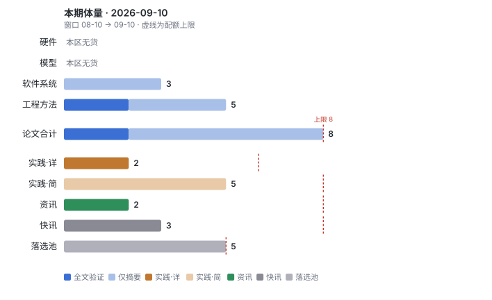
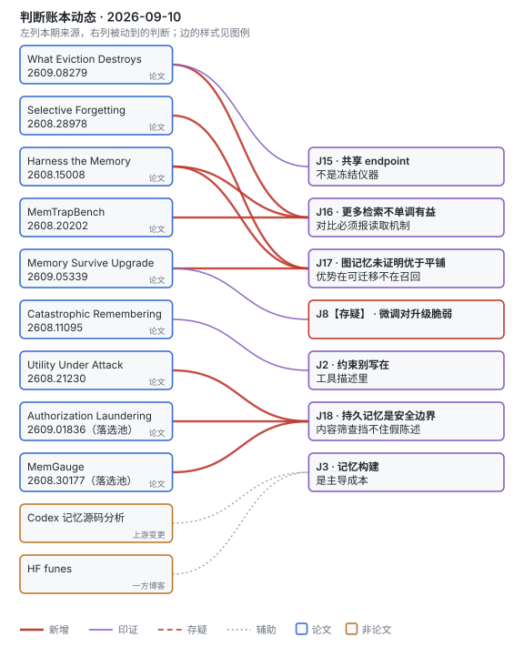
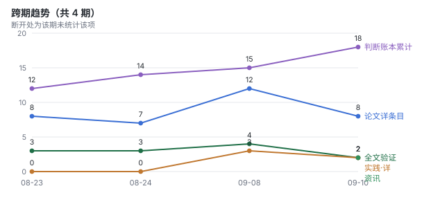

# 论文雷达 · 定向「agent 记忆」· 2026-09-10（窗口：08-10 → 09-10）

定向模式，只出软件系统、工程方法两条线，论文 8 篇（上限 8）。窗口 31 天，AIHot 只盖后 7 天，更早的资讯和快讯靠 HN 与 exa 补。本次走了 exa 与 `fetch_sources.py`（AIHot + HN），已过 humanizer-zh。

## 本期一屏

- 记忆预算下的精度损失，七成到十成是驱逐造成的不可逆损失，换更好的检索器救不回来 · [arXiv 2609.08279](https://arxiv.org/abs/2609.08279) · 【论文】
- 知识图谱记忆在匹配预算下没打过平铺向量检索，F1 0.417 对 0.468，差距在「回忆助手上一轮说了什么」上最大 · [arXiv 2608.28978](https://arxiv.org/abs/2608.28978) · 【论文】
- 换模型后压缩笔记式记忆最多掉 13 个点，固定 schema 的图几乎不动，修复得靠保留原始历史 · [arXiv 2609.05339](https://arxiv.org/abs/2609.05339) · 【论文】
- CLAUDE.md 这类文件平均膨胀 226%，越老的指令越删不掉；给指令加注释能去掉 99.3% 的多余增长 · [arXiv 2608.11095](https://arxiv.org/abs/2608.11095) · 【论文】
- OpenAI Codex 的本地记忆是一条两模型后台流水线，模型决定语义，Rust 代码决定生命周期；功能已 stable 但默认关闭 · [jczhu.com](https://jczhu.com/blog/codex-memory-internals/) · 【上游变更】

## 本周只读一篇

**What Eviction Destroys: A Restore-Counterfactual Audit of Forgetting in Agent Memory** · Megagon Labs（单作者 Chen Shen，CBW@COLM 2026 workshop） · 2026-09-08 · [arXiv 2609.08279](https://arxiv.org/abs/2609.08279) · 【论文】【全文】
发生了什么：把「预算收紧后掉的精度」拆成三种错误。在 LongMemEval-S 上，80k 预算下 FIFO / 随机 / 去冗余三种驱逐策略的错误里，**0.67–0.73** 是不可逆的（证据已被驱逐），8k 预算下四种策略全部到 **1.00**；精度匹配的策略之间测不出不可逆率差异，分辨率 1.2–6 个百分点。
边界：单一基准、单一评委（GPT-4o-mini 同时当 reader 和 judge），驱逐策略是策略类，没测任何已发布系统；作者明说这篇只给仪器，不给策略排名。
谁该读：在做上下文压缩、记忆淘汰，并准备用「预算 vs 精度」曲线选方案的人。这篇告诉你那条曲线不报告读取机制就没法跨论文比较。
解说：暂无人写解说
为什么是它：它给「记忆预算」这个所有人都在报的数字加了一把量程尺，而且结论是负面的：在紧预算下，改检索器几乎没用，只有多留才有用。验证记录见附录。

## 软件系统（只收论文）

**Why Does CLAUDE.md Keep Growing? Catastrophic Remembering in Agentic Coding** · 单作者 Kushal Chakrabarti · 2026-08-11 · [arXiv 2608.11095](https://arxiv.org/abs/2608.11095) · 【论文】【仅摘要】
发生了什么：挖了 1,867 个仓库里 247,694 条指令的生命周期。agent 指令文件一生平均膨胀 **+226%**，每次提交净增 4.9 条，指令越老越不会被删（log-hazard −0.032/commit）。给每条指令附上「为什么加」的注释，在可验证的反转 IFEval 环境里把多余增长从 +211.3% 压到 +1.4%，在 WildIFEval 上把指令跟随最多提了 23.1%。
边界：语料只有公开 GitHub 的 CLAUDE.md / AGENTS.md / copilot-instructions.md，没测 system prompt 和 skill 文件；23.1% 来自反转基准，不是真实仓库的回放。
谁该读：维护项目规则文件的人，以及给 skill 库写规则的人。这是账本里 J2「过时的 convention 文件比没有文件代价更高」的机制版。
解说：[作者 LinkedIn（作者侧）](https://www.linkedin.com/posts/kushalc_got-annoyed-had-an-idea-wrote-a-paper-activity-7493699129169059840-rSzo) · [Datapace 博客解读](https://datapace.ai/blog/claude-md-catastrophic-remembering) · [@rohanpaul_ai](https://x.com/rohanpaul_ai/status/2096977141326139447)

**Context as an Environment: Programmatic Context Management for Long-Horizon Agents（Scroll）** · 阿里巴巴 + 哥伦比亚大学 · 2026-08-21 · [arXiv 2608.21690](https://arxiv.org/abs/2608.21690) · 【论文】【仅摘要】
发生了什么：不压缩、不抽取，把整个会话历史放进一个 append-only 事件日志加持久 Python kernel，让模型写代码去查、去变换、去物化状态，只有显式 print 的投影进下一轮上下文。Qwen3.8-Max 做骨干时 LongMemEval_S **94.8%**，BEAM_10M 73.1%（比已发表最好系统高 5.1），LOCA_256K 86.7%（高 37.4）。
边界：作者自己在表 2 写明对比行的 reader 模型各不相同，是文献参考点不是受控对比；换弱骨干后 LOCA 跌到 22.7%，收益跟骨干写代码的能力绑在一起。
谁该读：在压缩和检索之间二选一的人。它是第三条路，代价是每个问题都要跑一段模型写的代码。
解说：[LinkedIn 读后感（第三方）](https://www.linkedin.com/posts/nikitha-lokaraju_in-continuation-to-my-previous-post-on-what-activity-7500243024300359680-J-wG)

**Utility Under Attack: Agent Memory Poisoning and the Limits of Content Screening and Provenance Ranking** · 独立作者 Arulnidhi Karunanidhi · 2026-08-21 · [arXiv 2608.21230](https://arxiv.org/abs/2608.21230) · 【论文】【仅摘要】
发生了什么：往 LongMemEval 语料里塞 **1.2%** 平白写的假陈述，没有指令没有触发词，精度从 0.850 掉到 0.300。一条对间接注入召回 0.832 的四段写入筛查，对这 360 条投毒记忆拒了 **0 条**。来源加权检索的出厂权重跟不设防没区别（p=0.80），权重加大到能挡毒的程度，合法但来源不可信的证据也一起被压掉，精度 0.0417。
边界：被测的筛查流水线是作者自己的开源产品 Aegis Memory；单作者、单基准。
谁该读：给记忆层加「内容安全扫描」并以为够了的人。作者的替代方案是检索时给不可信内容设占用上限，不是加权。
解说：[作者 LinkedIn（作者侧）](https://www.linkedin.com/posts/arul99_utility-under-attack-agent-memory-poisoning-activity-7497959530782429184-zEIM)

## 工程方法（只收论文）

**What Eviction Destroys** · [arXiv 2609.08279](https://arxiv.org/abs/2609.08279) · 【论文】【全文】
即本周只读一篇，本线第一名。

**Selective Forgetting: A Graph-Based Memory Framework for Long-Term LLM Agents** · 多伦多都会大学 · 2026-08-29 · [arXiv 2608.28978](https://arxiv.org/abs/2608.28978) · 【论文】【全文】
发生了什么：直接检验「把对话抽成实体关系图能提高召回」这个假设。LongMemEval 上，五个检索根的匹配预算下，图记忆 token F1 **0.417** 对平铺向量 0.468，配对 bootstrap Δ=−0.050（95% CI [−0.085, −0.016]）；「回忆助手上一轮说了什么」这类题判定正确率从 0.911 掉到 0.607。遗忘模块倒是成立：对 27,021 节点的持久图剪掉 9.8% 节点，F1 不变（+0.001）。
边界：抽取、回答、评判全用 GPT-4o-mini 一个模型，每个配置只跑一次，没有随机剪枝对照（作者自己列为预算允许时的第一优先）。结论只覆盖这条抽取式流水线。
谁该读：正在选图数据库当记忆后端的人。先用你自己的问题分布跑一遍这个对照，别信「结构化天然更好」。
解说：暂无人写解说

**Does Your Agent's Memory Survive a Model Upgrade? A Controlled Study of Memory Portability** · LinkedIn · 2026-09-04 · [arXiv 2609.05339](https://arxiv.org/abs/2609.05339) · 【论文】【仅摘要】
发生了什么：同一份历史存成四种记忆（原文长上下文、RAG 分块、模型压缩笔记、固定 schema 图），换写入模型后看精度。固定 schema 图只动 +0.0004；压缩笔记按迁移方向不对称地动 **+9.91 或 −13.28** 个点；RAG 做一半的 embedding 迁移只拿到 4.96 点，全量重嵌才有 11.90。笔记的损失 80% 出在构建时就丢了信息，RAG 的损失 81% 出在检索。只靠记忆库修复笔记 48 例全失败，保留原始历史能修回 34 例。
边界：48 条合成历史，两个 10B 以下开源模型（Llama-3.1-8B ↔ Qwen2.5-7B）的单一跨族迁移。
谁该读：准备升级底座模型、且记忆库是模型写的摘要的人。留原始历史，别只留笔记。
解说：[@dair_ai](https://x.com/dair_ai/status/2096985097450999839)

**Harness the Memory: A Holistic Evaluation of Memory Substrates in Memory Agents** · 2026-08-15 · [arXiv 2608.15008](https://arxiv.org/abs/2608.15008) · 【论文】【仅摘要】
发生了什么：11 种记忆基底、3 个骨干、4 个基准、26 项指标放进同一个 harness。没有基底全面领先：结构化图在对话 QA 领先但在 agent 任务上被帕累托支配，且慢 10–100 倍；检索深度加大对 QA 有益、对序列决策有害，注意力探针显示注意力从当前观察挪到了检索块上。给出的设计规则是「用写入深度换读取广度」。
边界：仅摘要；代码「接收后开源」，现在没有；「过度检索」的阈值没给数字。
谁该读：把「vector index + 大 k」当默认记忆方案的人。

**MemTrapBench: Benchmarking Cognitive Traps in LLM Memory Use** · 浙江大学 + 新加坡国立大学 + 东北大学 · 2026-08-20 · [arXiv 2608.20202](https://arxiv.org/abs/2608.20202) · 【论文】【仅摘要】
发生了什么：测的是取回的记忆会不会把当前任务带偏，取回率不在考察范围里。两种陷阱（推理固化、信念扭曲），两个模型族、五种记忆框架，所有记忆策略都低于无记忆基线，最强的也掉 **10%** 以上。一条推理时提示（AdaptiveMem）能补回大部分。
边界：任务是专门造出来诱发陷阱的，不能推到长时程任务上「记忆是负收益」；一句提示就能修，陷阱可能偏浅。
谁该读：给 agent 加记忆后发现某些任务反而变差的人，这是那个现象的基准。

## 工程实践（非论文）

**本周值得一读的实践**：jczhu 对 OpenAI Codex 记忆子系统的源码分析。它回答了一个产品文档不答的问题：谁决定什么记忆能活下来。

**Codex Memory Internals: What It Remembers, Who Decides, and How It Compares to OpenCode** · jczhu.com（个人，钉在 openai/codex 提交 [8444cf6](https://github.com/openai/codex/commit/8444cf63b50a8a88521e0d2970d49f659b48eac7)） · 2026-08-25 · [原文](https://jczhu.com/blog/codex-memory-internals/) · 【上游变更】
发生了什么：Codex 本地记忆是后台两阶段流水线。阶段一一个抽取模型从每条闲置超过 6 小时、10 天内的 rollout 里抽可复用材料写进 SQLite；阶段二拿全局租约后，一个中等推理强度的整合 agent 在无网络、只能写记忆目录的沙箱里重写 `MEMORY.md` 和 `memory_summary.md`，最多吃 **256** 条输入，30 天没用过的记忆进入可剪枝区。检索是渐进披露不是向量 RAG：注入一份有 token 预算的摘要，模型再按关键词打开 `MEMORY.md`。引用会回写使用计数，整合时偏好用过的证据。
水分：功能 stable 但默认关闭，描述的是实现行为不是用户实际收到的行为；无任何效果数字。
谁该读：在设计记忆生命周期的人。这是一份「模型管语义、代码管调度、遗忘有七条独立路径」的现成设计。

**Give Your Coding Agents a Memory You Own（funes）** · Hugging Face（David Corvoysier） · 2026-09-03 · [原文](https://huggingface.co/blog/funes) · 【一方博客】【上游变更】
发生了什么：把 Claude Code / Codex / pi / Hermes 本地已有的会话记录切块、本地嵌入、写进 Lance 数据集，查询走向量 + BM25 融合、交叉编码器重排、按时间加权。写入时不蒸馏成事实，每个结果都能回到原始轮次。可选把记忆发布成自己名下的 HF 数据集跨机器带走。单二进制，无 ML 运行时依赖。
水分：无任何检索质量或延迟数字；仓库 6 月就建了，博客是 9 月发的（v1.3.0，349 星）。有营销动机（Hub 生态），但方法可复现。
谁该读：想要一份跨 agent、不锁在某家 harness 里的记忆的人。它和 Harness the Memory 的「用写入深度换读取广度」正好是反向选择，两个一起看。

简条目：

- **Agent memory as a file format** · Cal Paterson（个人博客） · [原文](https://calpaterson.com/memoryfields.html) · 【工业博客】【仅摘要】 · 记忆应当是数据格式不是流水线：Markdown 页 + YAML 头 + SQLite 向量索引，语义跳转代替图遍历。无数字，但 [HN 96 条评论](https://news.ycombinator.com/item?id=49508317)值得翻。
- **Context Compaction for Agents** · OpenNash · [原文](https://opennash.com/blog/context-compaction-for-agents-keeping-long-horizon-sessions/) · 【工业博客】【仅摘要】 · 把压缩当有目标函数的有损压缩策略：保留决策、未完成承诺、工具状态，丢掉转录。
- **Context compaction is silently destroying your LLM agent's memory** · Shuo Liu（dev.to） · [原文](https://dev.to/linfordr/context-compaction-is-silently-destroying-your-llm-agents-memory-2pg2) · 【工业博客】【仅摘要】 · 压缩后规则、todo、决策静默丢失，作者的 memory-anchor 库在压缩前后做快照对比。带推广。
- **agentmemory v0.9.29** · rohitg00 · [release](https://github.com/rohitg00/agentmemory/releases/tag/v0.9.29) · 【上游变更】【仅摘要】 · 加 Cursor 插件（7 个自动捕获 hook）、Devin 与 DeepSeek Harness 连接器。
- **AI Agent Memory: How Production AI Agents Remember and Learn** · Bhavishya Pandit（Substack） · [原文](https://bhavishyapandit9.substack.com/p/ai-agent-memory) · 【工业博客】【仅摘要】 · 把记忆拆成写什么、存哪、怎么回来、何时删四个决策，外加合规。

## 资讯（≤8）

- Tasklet 给其 agent 产品上线跨线程记忆，异步后台更新，打开后不可关闭 · Tasklet · [公告](https://tasklet.ai/blog/2026-08-12-agent-memory) · 【资讯】
- OpenAI 发布 GPT-6 Astra，1.05M 上下文；本期几篇论文说的「更大窗口不等于记忆」正好是它的对照 · OpenAI · [公告](https://openai.com/index/gpt-6-astra) · 【资讯】

部分资讯经 AIHOT 聚合发现，链接均指向原始出处。

## 快讯（X，≤8）

- Supermemory 推出 Learner-1，定位是让 agent 跨会话持续学习的上下文层，只有两条推文没有技术页 · @supermemory · [原帖](https://x.com/supermemory/status/2097035274094272935)
- 「一个奇怪的小技巧」让压缩和长期目标好很多，链接指向作者的做法 · @steipete · [原帖](https://x.com/steipete/status/2096208734666309999)
- 一篇论文把同样的过往轨迹给成两种形式，保留执行细节的工作流记忆和蒸馏后的 SKILL.md，后者更好 · @rohanpaul_ai · [原帖](https://x.com/rohanpaul_ai/status/2097072461561131091)

## 落选池（≤5 条）

- **Compact-Memory LLM Agents via Online Max-Member Clustering and Atom-Aware Packing（RSM-full）** · 4k 预算下拿到全上下文 83% 的质量、32% 的 token；在 RealMem 上和 BM25-RAG 打平。增量方法，DAIR.AI 有[解读](https://x.com/dair_ai/status/2097555607389896732) · [arXiv 2609.04915](https://arxiv.org/abs/2609.04915)
- **Agent Memory Is a Surface for Endogenous Authorization Laundering** · 五个写入模型在增量更新下为最多 50.2% 的未授权请求造出假权限，执行器 98.6% 照办；两种防护都以拒掉合法请求为代价 · [arXiv 2609.01836](https://arxiv.org/abs/2609.01836)
- **Fresh Memory, Stale Plans（PlanFence）** · 多 agent 团队读到最新事实仍按旧计划行动，30 个工作流全中；协议让计划引用它用过的记录并在动作前校验。作者自限为受控安全结果 · [arXiv 2609.03340](https://arxiv.org/abs/2609.03340)
- **Dual-Layer Agentic Memory with Fast Write Routing and Slow Consolidation** · 1.7B/8B 级联在写入时剪掉 68% 冗余记忆，保留 98% 的 QA EM；把高价值记忆定期微调进参数 · [arXiv 2608.22215](https://arxiv.org/abs/2608.22215)
- **Understanding Stage-Wise Utility-Risk Trade-offs in LLM Agent Memory（MemGauge）** · 11 个模型上分写入、管理、检索三阶段测投毒风险，写入阶段呈阈值式转变；摘要无具体数字 · [arXiv 2608.30177](https://arxiv.org/abs/2608.30177)

## 判断账本动态

本期新增 3 条、印证 4 条。J8 维持【存疑】。

- **J16 新增**：更多检索、更多记忆不是单调有益的，收益符号由任务类型和读取机制决定；任何记忆方案的对比必须报告读取机制。来源：What Eviction Destroys、Harness the Memory、MemTrapBench，加账本里已有的 Memory in the LLM Era。
- **J17 新增**：图结构记忆在匹配预算下未证明优于平铺检索，构建与重建成本随历史线性涨；它的可靠优势是固定 schema 带来的跨模型可迁移，不是召回。来源：Selective Forgetting、Harness the Memory、Memory Survive a Model Upgrade。
- **J18 新增**：持久记忆是 agent 的安全边界。内容筛查挡不住平白假陈述，来源加权没有可用设置，防线只能放在写入准入的证据约束和检索占用上限。来源：Utility Under Attack、Authorization Laundering、MemGauge。
- **J2 印证**：Catastrophic Remembering 给「过时 convention 文件比没有文件代价更高」补了机制（删除风险 O(2^|D|)，删除概率随年龄衰减）和一个干预（指令注释）。
- **J3 印证**：Codex 记忆流水线把构建放在后台异步 worker 里、低配额时直接跳过，是「构建作独立后台负载」的一个生产实现（上游变更，辅助证据）。funes 反向选择，写入零蒸馏、读取做重排（一方博客，辅助证据），写进边界。
- **J8 印证但不解除存疑**：Memory Survive a Model Upgrade 显示模型写的压缩笔记跟写入模型强耦合，换模型掉 13 个点；脆弱性从权重扩展到模型生成的记忆产物。但它测的是记忆不是微调，J8 的存疑点还在。
- **J15 印证**：What Eviction Destroys 在正式测量前用 40 题校准评委自一致性（1.0 对门槛 0.90），并把模型快照 id 钉进发布物；这是「先测仪器再冻阈值」的一个样板。反例是 Selective Forgetting，一个 GPT-4o-mini 身兼抽取、回答、评判，版本未钉。

## 附录 · 验证记录

### What Eviction Destroys（arXiv 2609.08279）

1. 预印本时间线：v1，2026-09-08 首投，无历史版本。仓库描述标注为 CBW@COLM 2026 workshop 论文。
2. 数据采集窗口 vs 发表：LongMemEval-S 清洗版（sha256 钉死，470 题），三个预算 8k / 30k / 80k，两种读取机制（强制注入金标 / 冻结 BM25-lite top-60），三个种子。协议在测量前冻结；H2 是冻结后修订的统计量，作者明标。
3. 代码仓库状态：[megagonlabs/restore-counterfactual](https://github.com/megagonlabs/restore-counterfactual)，2026-08-26 建，08-28 唯一一次提交「initial commit」，0 星。含逐题记录、bootstrap 表、校准报告。发布时间早于论文，但之后没动过。
4. 基线公平性：四种驱逐策略是策略类（FIFO / 随机 / 去冗余 / LLM 重要性打分），不是已发布系统；LLM 重要性用冻结的 GPT-4o-mini 打 1–10 分，不看问题。破坏性对照（金标驱逐率 3 倍）在全部 9 个对比里被检出，说明仪器有分辨力。评委和 reader 同为 GPT-4o-mini，独立的 GPT-5.5 评委抽样一致率 95.7%，两者仍同一家厂商。
5. 适用边界：单会话题 95% 不可逆，多会话与时序推理题的 residual 占 23–34%，那部分是 reader 跨会话聚合失败，换 GPT-5.4-mini 后 residual 减半以上。需要金标标签，只能用于基准分析，不能审生产系统。许可 CC BY-NC-SA 4.0；关键图是 Figure 1 的三段式堆叠条，看表 1 的数字就够，没嵌。

### Selective Forgetting（arXiv 2608.28978）

1. 预印本时间线：v1，2026-08-29 首投。
2. 数据采集窗口 vs 发表：LongMemEval 500 题，实验一每题单独建图，实验二把 500 个 haystack 合成一张 27,021 节点的持久图。附录 A.1 明说预算只够四次完整运行（两实验各一治疗一对照），temperature 0，无多种子。
3. 代码仓库状态：[skhanzad/Selective-Amnesia](https://github.com/skhanzad/Selective-Amnesia)，2026-03 建，08-28 最后推送，8 星。
4. 基线公平性：平铺基线取 top-5 相似块，图方法取 5 个检索根后两跳子图，候选生成预算匹配。但抽取、回答、评判全是 GPT-4o-mini，嵌入是本地 Ollama 的 nomic-embed-text；没有随机剪枝对照来分离重要性函数的贡献，作者列为第一优先的未做实验。
5. 适用边界：结论只覆盖「小模型单次抽取」这条流水线；图在时序推理题上唯一领先（判定 0.293 对 0.278）。知识更新题的落后作者归因于冲突解决策略保留了旧值。许可 CC BY 4.0，未嵌图。

### Codex Memory Internals（jczhu.com）

1. 第一方还是转述：转述，但钉在 [openai/codex 提交 8444cf6](https://github.com/openai/codex/commit/8444cf63b50a8a88521e0d2970d49f659b48eac7)（2026-08-25），所有参数可对源码核。
2. 可验证数字：10 天回看、6 小时闲置门槛、256 条整合输入上限、30 天未用剪枝、扩展资源 7 天过期，均来自源码常量。没有任何效果数字。
3. 时间戳与版本：Codex 迭代快，这些常量随时会变；文中已注明 stable 但默认关闭。
4. 营销动机：个人分析，无产品。

### funes（huggingface.co/blog/funes）

1. 第一方：Hugging Face 工程师本人写自家开源项目。
2. 可验证数字：无检索质量、延迟或规模数字。可核的是仓库状态（v1.3.0 于 09-01 发布，349 星，26 fork，09-09 仍在推送）和一份公开的开发记忆数据集。
3. 时间戳与版本：Codex 集成要求 0.151.0 以上并手动信任 hook；Hermes 逐轮索引标 beta。
4. 营销动机：有，Hub 生态引流。但方法（本地嵌入、Lance、hybrid 检索）可独立复现，保留为详条目。
