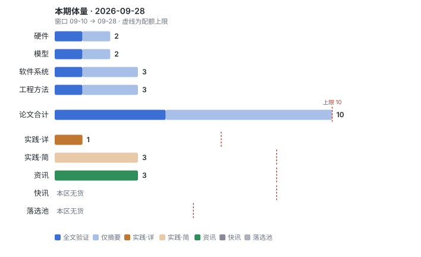
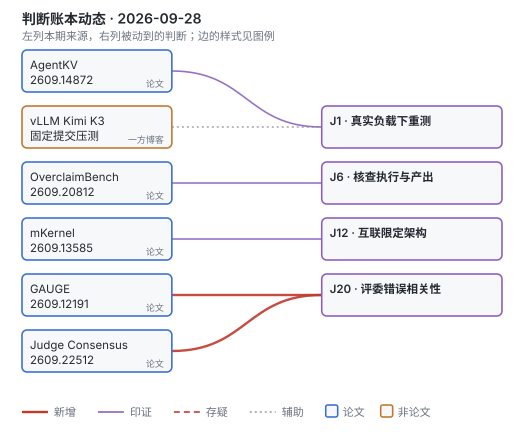
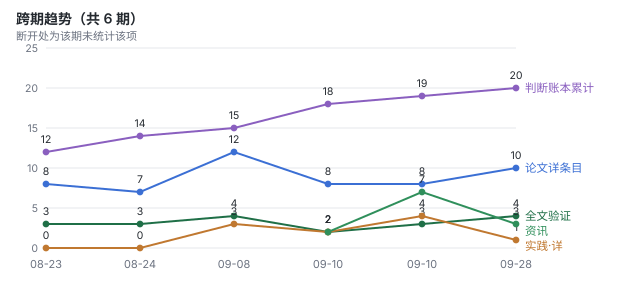

# 论文雷达 · 2026-09-28（窗口：09-10 → 09-28）

距上次周扫 18 天，本期论文扩容至 10 篇，四条线全扫。4 篇读全文，6 篇仅核摘要；首推在工程方法节不重复计数。日期按来源页面记录。

本次已调用 Exa 搜索与全文抓取，并先跑 AIHot / HN 候选扫描。**AIHot 只盖后 7 天，更早资讯靠 HN 与 Exa**；脚本未报错。mKernel 和 AgentKV 是本窗口新增 arXiv 版本的已有工作，早期公开记录见附录。没有实跑论文代码或复现 GPU 实验。

## 本期一屏

- **本周只读一篇：GAUGE**。总体排名相关系数 0.94，能力接近的候选却有 31% 排错；评委平均也没解决。· [论文](https://arxiv.org/abs/2609.12191) · 【论文】
- mKernel 把计算、节点内通信和 RDMA 放进同一 kernel；在 16 张 H200 上，Ring Attention 相对分离基线最高 1.88×。· [论文](https://arxiv.org/abs/2609.13585) · 【论文】
- AgentKV 按思考、调用、工具返回等阶段保留 KV；控制实现差异后，12 个配置平均仍多 4.2 个百分点。· [论文](https://arxiv.org/abs/2609.14872) · 【论文】
- 客服微调比较 13 个模型：多任务全参微调便于统一部署，顺序更新有严重遗忘；LoRA 在部分任务仍更好。· [论文](https://arxiv.org/abs/2609.27262) · 【论文】
- vLLM 的 Kimi K3 优化给出固定提交与命令：B300、8K 输入 / 1K 输出、并发 1–16 下，吞吐提高 2.2–2.8×。· [原文](https://vllm.ai/blog/2026-09-13-kimi-k3-performance-optimization) · 【一方博客】

## 本周只读一篇

**GAUGE: When Not to Trust LLM-as-a-Judge in User-Simulated Evaluation of Task-Oriented Agents** · Amazon · 09-10 · [论文](https://arxiv.org/abs/2609.12191) · 【论文】【全文】  
发生了什么：25 个模型与温度配置的总体排序相关系数为 0.94，但收益差 <0.1 的候选对有 **31% 排错**；四评委平均仍为 31%。  
边界：人工面板“满意却失败”的 57.5% 不能套到所有评委；另一组样本中，带政策与结果信息的评委把接受后失败率从基准 40.2% 降至 20%。  
谁该读：用用户模拟器、满意度或 LLM 评分决定 Agent 发版的人。  
解说：暂无人写解说（本轮限定检索内未找到合格导读）。  
为什么是它：接近上线门槛时，整体相关性很容易给人错误信心。论文把“用户体验好”和“任务完成”分开量，也保留了有效的结果校验路径。验证记录见附录。

## 硬件

**mKernel: Fast Multi-GPU, Multi-Node Fused Kernels** · UC Berkeley 等 · arXiv 09-11 · [论文](https://arxiv.org/abs/2609.13585) · 【论文】【全文】  
发生了什么：在 2 节点 × 8 H200 的 InfiniBand 集群上，融合 kernel 的 GEMM + AllReduce 最高 **1.72×**、Ring Attention 最高 1.88× 分离基线。  
边界：5 月已有作者博客；这不是端到端训练加速。自适应 SM 调度另在单机 8 H100 测，MoE 最大倍率还混入了 grouped GEMM 等实现差异。  
谁该读：做分布式 kernel、集合通信与计算重叠的人。  
解说：[作者侧博客，05-25](https://uccl-project.github.io/posts/mkernel/)。

**Taming Bitwise Behavior in GPU Kernels with Tensor Core: Black-Box Reconstruction, Compiler Enforcement, and Static Verification** · Georgia Tech / Meta · 09-10 · [论文](https://arxiv.org/abs/2609.11356) · 【论文】【仅摘要】  
发生了什么：通过重建归约次序与静态验证约束浮点行为；GB300 / H100 测试中，27 个 kernel 有 **19 个**的固定次序版本距自由次序性能不超过 10%。  
边界：测的是指定 kernel 的逐位一致性，不能据此宣称整个推理服务在任意并发下确定。  
谁该读：做 Triton 编译、数值回归测试和可复现推理的人。

## 模型

**Can One Adapted Model Do It All? Fine-Tuning Strategy Selection for Customer Support LLMs** · Dialpad · 09-23 · [论文](https://arxiv.org/abs/2609.27262) · 【论文】【全文】  
发生了什么：13 个模型、8 个客服数据集比较专才、多任务、顺序更新与合并；Qwen3-8B 顺序全参更新后，早期意图分类从 **99.5 降至 25.9**，LoRA 保留至 78.6。  
边界：多任务全参是作者建议的部署默认值，并非每格最高；完整策略网格只覆盖 7 个核心模型，半数数据私有，生成任务主要用 ROUGE-1。  
谁该读：要在单一客服模型、多个 LoRA 与专才路由之间做选择的人。

**Low-Bit Recurrent States in Hybrid Language Models** · Hongren Chen / Jiayang He · 09-25 · [论文](https://arxiv.org/abs/2609.30950) · 【论文】【仅摘要】  
发生了什么：按通道衰减分配循环状态精度，无需训练或校准；4-bit 平均载荷下，额外负对数似然误差相对基线降低 **3.3–27.9×**，6-bit 与 FP32 的差 <0.005 nats。  
边界：数字是三个模型上的误差倍率，不能换算成吞吐倍率；元数据和分块写回会改变实际收益。ICASSP 2027 为投稿状态。  
谁该读：压缩混合注意力模型的循环状态、评估低精度误差的人。

## 软件系统

**AgentKV: Phase-Aware KV Eviction for Agentic LLMs** · Imperial / Columbia · arXiv 09-14 · [论文](https://arxiv.org/abs/2609.14872) · 【论文】【全文】  
发生了什么：用阶段代表 query 代替最近 query，在共享打分和服务实现的 12 个配置中平均提高 **4.2 个百分点**；H100 NVL、Qwen3-32B 的特定负载最高达上游 SGLang 吞吐的 1.80×。  
边界：已有较早会议记录；实现是 Mini-SGLang 与基准分支，非上游即插即用。紧预算仍掉分，对 R-KV 的 36 格只有 15 格增益获置信区间支持。  
谁该读：做长轨迹 Agent 服务、KV 淘汰和请求并发的人。

**DeepSeek Elastic Compute (DSec): A Sandbox Infrastructure for Effective Agentic Training at Scale** · DeepSeek 等 · 09-18 · [论文](https://arxiv.org/abs/2609.22978) · 【论文】【仅摘要】  
发生了什么：把函数、容器、microVM 与完整 VM 接入统一沙箱平台；作者报告 160 节点每天约 **300 万**次沙箱创建，峰值并发 >38 万、创建速率 >5,000/s。  
边界：这是生产系统自报的不同容量指标；并发沙箱数不等于同时满载的 CPU 数，也不代表所有后端都达到相同指标。  
谁该读：做 RL rollout、代码执行沙箱和有状态环境调度的人。  
解说：[HN 讨论，检索时 110 评论](https://news.ycombinator.com/item?id=49859112)。

**Jev-Mem: System-One-Controlled Agentic Memory for Efficient AI Agents** · UT Dallas · 09-21 页面 · [论文](https://arxiv.org/abs/2609.23986) · 【论文】【仅摘要】  
发生了什么：用轻量结构化控制器决定记忆组织、检索预算与停止；LoCoMo 的 judge 分数为 0.777，构建 **158 秒、快 6.6×**，查询 0.93 秒、延迟低 36.7%。  
边界：相对不同最强/最快基线的指标不能合成一个倍率；尚未核验匹配预算与图结构的独立贡献，也不是生产 Agent 成功率。  
谁该读：想减少记忆系统中反复生成控制文本成本的人。  
解说：[Remy 的结构与实验解读](https://redreamality.com/blog/jev-mem-system-one-agentic-memory/)。

## 工程方法

本线第一篇为上面的 GAUGE，已全文验证，不重复计数。

**Agreement Overstates Evidence: Error Dependence in LLM Judge Consensus** · UCF · 09-18 · [论文](https://arxiv.org/abs/2609.22512) · 【论文】【仅摘要】  
发生了什么：10 个评委的错误平均相关性约 0.21，信息量相当于 **3.5 个独立评委**；考虑依赖后，最高 28% 的模型比较不再有统计显著性。  
边界：等效数量取决于任务和错误结构；换厂商不能自动保证独立，摘要级核验也不足以直接采用其校正公式。  
谁该读：做多评委投票、自动偏好标注、排名置信区间的人。

**Quantifying Overclaiming Propensity in Frontier LLM Agents** · Tara Research / Mila 等 · 09-17 首次提交 · [论文](https://arxiv.org/abs/2609.20812) · 【论文】【仅摘要】  
发生了什么：8 个闭源、4 个开放权重模型做五类文件审查，**67.9%** 的运行未触及全部文件；其中 80.4% 仍声称完成或未说明缺口。  
边界：“触及文件”只要求出现其中一行，不能代表读完；闭源模型使用各自 CLI，模型与 harness 效应混在一起，缺陷漏检的 1.8× 是相关性。  
谁该读：做编码 Agent、自动审查与完成状态验证的人。

## 工程实践（非论文）

**本周值得一读的实践：vLLM 的 Kimi K3 优化。** 它把完整吞吐变化拆回调度预算、状态存储和小张量搬运，并给出命令与固定提交。

**Kimi K3 Performance Optimizations in vLLM: The Road to 2.8× Throughput** · vLLM 团队 · 09-13 · [原文](https://vllm.ai/blog/2026-09-13-kimi-k3-performance-optimization) · 【一方博客】【全文】  
发生了什么：B300、TP8、8K/1K 合成负载，在并发 1/4/16 下从 v0.27.1 到提交 82a85dc1，吞吐 **2.2–2.8×**，平均延迟下降 56%–60%。  
水分：两端均关闭 prefix caching，旧版存在已知问题；整栈多项变更的总收益不可归功于单个 kernel，也不能把各项独立百分比相加。  
谁该读：服务混合模型、排查低并发 TTFT 和状态缓存开销的人。

简条目仅作线索，不视为已通过实践四项核验；下列原文虽作过筛选性阅读，仍按简条目降级。

- **Quail：查询计划与推理引擎协同** · Modal / CMU · 09-24 · [原文](https://modal.com/blog/quail-billion-tpm) · 【工业博客】【仅摘要】 · 单个 join 的十亿 token/分钟含可复用前缀，不能当生成速率；全基准几何平均是 1.84×，缺少本轮完整版本对账，降为线索。
- **MiMo-V2.6 的工具调用重复复盘** · Xiaomi · 09-27 · [原文](https://mimo.xiaomi.com/blog/mimo-v2-6-tool-call-repetition) · 【一方博客】【仅摘要】 · 统计轮内相同 JSON 参数调用，不能涵盖语义近似或跨轮重复；选出的失败回放也不能代表线上总体。
- **ARCv3 与跨区 RL 权重同步** · Fireworks · 09-23 · [原文](https://fireworks.ai/blog/arcv3-and-the-case-for-cross-region-rl) · 【一方博客】【仅摘要】 · 1,000 份生产 BF16 权重差量平均压到原模型大小的 0.19%；原始样本与 CPU 成本未在本轮核全，不能直接算训练加速。

## 资讯

- 09-22，vllm-metal 发布 Apple Silicon 并发服务方案；首个官方版本为 v0.28.0，当前公告安装段已更新到 v0.29.0。· vLLM · [公告](https://vllm.ai/blog/2026-09-22-vllm-metal-v0-28-0) · 【资讯】
- 09-22，Transformers 增加调用 ggml kernel 运行 GGUF 量化模型的路径，初期聚焦 Apple Silicon 与 Qwen3.5；公告要求 main 分支及兼容 kernels。· Hugging Face · [公告](https://huggingface.co/blog/transformers-llama-cpp-quants) · 【资讯】
- 09-23，Antigravity SDK 公告增加本地模型支持，包含通过 LiteRT 运行 Gemma 4 的路径。· Google · [公告](https://developers.googleblog.com/introducing-support-for-local-ai-models-in-the-antigravity-sdk) · 【资讯】

部分资讯经 AIHOT 聚合发现，链接均指向原始出处。

## 快讯（X）

无。本轮候选中的相关事件已有第一方页面，已归入上面的实践或资讯；未核实的原帖不收。

## 落选池

无另列条目。

## 判断账本动态

- J1 印证：AgentKV 的 1.80× 绑定 H100 NVL、32B 与 32K 输入负载；vLLM 博客补充固定版本下的并发差异。
- J6 印证并补充边界：OverclaimBench 支持独立核查执行与产出，单靠“读取过”或模型宣称完成仍不足够。
- J12 印证边界：mKernel 同时覆盖 IB 与 EFA，但都约 400Gbps/GPU；这些结果不回答普通低带宽以太网是否划算。
- J20 新增：多个 LLM 评委的同意不能按独立证据累计；先测错误相关性与接近候选的排序错误，再决定投票与置信区间。

## 附录 · 验证记录

### GAUGE

1. **时间线**：[arXiv](https://arxiv.org/abs/2609.12191) 首次提交 2026-09-10 20:29 UTC。本轮读 v1 全文与附录，未发现更早同题版本；这不等于穷尽了所有前身。
2. **数据时间**：模型梯度实验涉及 14 个模型、25 个模型/温度配置、六个提供方；另有 12 个受控退化配置。约 3,700 份轨迹是跨设置总量，盲评人工面板只有 150 份、每份三位评分者。未找到完整采集起止日期，不能用发表日代替测量日。
3. **代码状态**：全文和一次解说检索均未定位到可核验的独立发布仓库。已有协议、表格和附录不等于完整可运行复现包；本轮未验证复现。
4. **基线与统计**：近似候选的 31% 是 27/87 对，报告区间约 11.6%–50%，精度有限。人工满意度的 57.5% 接受后失败接近该分层样本自身的 57.3% 基准失败率。政策感知评委使用另一自然样本池，其 20% 与 40.2% 应在同池比较，不能和 57.5% 直接相减。四评委平均仍排错 31%；校准后可拒绝排序的方案，在保留子集降到 14.8%，以弃权换可靠性。
5. **适用边界**：是合成客服任务，不是线上客户研究。航空奖励主要按确定性任务结果，零售部分还带自然语言断言的模型判断，所以全文概括的“non-LLM reward”需要限定。96.5% 失败仍正常结束，正常完成标志总体仅召回 3.5% 失败；它在特意截断的退化实验中有效，不能替代语义结果校验。底层服务的精确快照与实测日期不够完整。

### mKernel

1. **时间线**：arXiv 首次提交 09-11，但[作者博客](https://uccl-project.github.io/posts/mkernel/) 明写 **05-25**，仓库引用同样按 5 月。这次收的是新上 arXiv 的论文记录，不能说方案在 9 月刚诞生；旧账本未收录此工作。
2. **数据时间**：正文未明确给所有实验的测量起止日。参考文献的 09-10 是文档访问日期，不当作实验日期。
3. **代码状态**：[mKernel 仓库](https://github.com/uccl-project/mKernel) 可访问，MIT，有构建说明、bench 目录和 CUDA 实现；默认 sm_90a、CUDA 12.9。它是 kernel 库，不是 vLLM/SGLang 已合并功能；本轮未克隆构建，也未核到稳定维护节奏。
4. **基线公平性**：GEMM 和 Ring Attention 各自有分离与融合基线，不能把每个峰值理解成胜过所有方法。MoE 的 3.1–4.5× 对照包含未用 grouped GEMM 的实现，收益归因混杂；EFA 图里的 DeepEP 对照还来自 IB 测试床，不能据此宣称严格同网优势。IBGDA 对 host-assisted GPU-initiated 路径未见一致优势，CPU 代理控制不等于 payload 经 CPU 搬运。
5. **硬件边界**：两个测试床均 2 节点 × 8 H200，分别 CX7 InfiniBand 和 AWS EFA，等效每 GPU 约 400Gbps 网络；节点内 NVLink 带宽远高于跨节点。自适应 SM 分配另在单机 8 H100 测，不能合并成“16 卡多机自适应端到端训练加速”。本文没有给出廉价以太网或千卡规模验证。

### 客服微调策略

1. **时间线**：[论文页面](https://arxiv.org/abs/2609.27262) 标注 09-23，读的是 v1。Exa 对 abs 的抓取返回正文，未取到独立 Submission history；本轮没有找到更早同题记录，首次提交日的核验强度低于直接读到历史的三篇。
2. **数据时间**：八套数据约 74.5k 训练 / 8.7k 评测，四公开、四私有；私有客服数据的采集起止日没有完整披露。13 个模型、五个家族、0.6B–32B；全部策略的主要对照只在七个核心模型开展。
3. **代码状态**：作者称会释放研究资源，但全文可见链接与一次检索未定位到可核验的实验仓库；不标为“代码已开源”。私有数据也限制独立复跑。
4. **基线公平性**：统一实验框架有助于比较，但 full / LoRA 使用不同学习率，LoRA 主要为 rank 16，并非穷尽各策略最优超参。多任务 full 是精度接近与单 checkpoint 维护之间的折中：Qwen3.5-9B 内部平均，MT-LoRA 69.8 仍高于 MT-Full 69.6；Qwen3.5-4B 公共平均 58.4 高于 56.8。顺序更新的反向顺序实验仍观察到早期任务遗忘。
5. **硬件与任务边界**：训练使用 56 H200 池、LLaMA-Factory / DeepSpeed ZeRO；评测配置为 vLLM TP8、8 A100 80GB、temperature 0。主要指标是标签精确匹配与生成 ROUGE-1；BERTScore 和 Gemini 3 Flash 评委只补充部分模型。结论限英文客服数据，不是跨版本模型升级耐久性测试，因此不据此解除 J8 的【存疑】。

### AgentKV

1. **时间线**：arXiv 首次提交 09-14。[ICML 页面](https://icml.cc/virtual/2026/75143) 已有同名工作；Exa 索引到 [OpenReview 记录](https://openreview.net/forum?id=s80e8otSxP) 的 06-01 日期，但直接抓取遇到浏览器验证，无法确认该字段究竟是提交还是公开时间。可确定它不是 9 月首次公开的全新方案；旧账本未收录。
2. **数据时间**：质量评估是 BFCL 与 τ²-bench 公共模拟任务，未收真人数据；论文未明确写完整运行日期。36 个模型/任务/预算配置的主比较与 12 个共享实现控制配置分开读，不能把 36 当 36 份独立数据集。
3. **代码状态**：[仓库](https://github.com/LiuTaowen-Tony/agentkv) 可访问，Apache-2.0，README 明确 engine、gorilla、tau2-bench 都是带补丁的子模块。需要递归克隆，是 Mini-SGLang 风格引擎与评测分支；当前没有证明其补丁已进入上游 SGLang，也未验证长期维护。
4. **基线公平性**：共享打分、compaction 和 serving 路径的最近 query 对照，仍平均增加 4.2pp，对方法归因比最高吞吐更有价值。对 R-KV 的 36 格中 15 格 CI 支持改善，21 格不确定；对 TriAttention 为 16/36，20 格不确定，没有显著输的格子不等于全部显著赢。紧预算 32B BFCL multi-turn 可为 42 对 FullKV 52，仍有损。
5. **硬件与版本边界**：1.80× 对上游 SGLang 0.5.12 / FlashInfer，绑定 H100 NVL、32B、32K 输入 / 1K 输出；8B 在 A6000 的峰值另为 1.76×。固定显存利用率、prefill 预算及 CUDA graph 等设置影响结果。相关状态已在最新工具响应或外部记忆中的任务，阶段保留收益较小；跨家族测试在最小预算也可能退步。

### vLLM Kimi K3 实践核验

1. **来源**：vLLM 团队第一方技术博客，09-13；全文有服务启动与 guidellm 压测命令、参数及结果表。
2. **数字上下文**：B300 节点、TP8、CUDA 13.3、8K 输入 / 1K 输出、DSpark 八个推测 token、并发 1/4/16。吞吐分别 83.3→183.3、166.7→416.7、258.3→725.0 tok/s。固定测量设置可核，但本轮没在 GPU 上复跑。
3. **版本绑定**：比较 v0.27.1 与 [82a85dc1](https://github.com/vllm-project/vllm/commit/82a85dc1)，该提交页面确实可访问，日期为 09-13。把它当历史版本实验；09-28 的 main 不能自动继承同一倍率。本轮检索未找到撤回该结果的记录，也未逐个重审全部 PR。
4. **营销与可复现性**：框架方自评有推广动机，但固定提交、启动命令和合成负载方法可由外部重跑，满足详细收录。两端 prefix cache 都关闭，理由是旧版有已知问题；ReplaySSM 的容量 +10.97% 和 DCP 的长共享前缀结果属于不同实验，不能加到 2.8× 上。一次脚本 lookup 与一次 Exa 未找到额外合格导读。

### 检索与取舍记录

- 四条论文线各做三种查询：arXiv 时间窗、会议名、主题簇；候选与既有两个账本核对。18 天窗口含起点当天，以去重账本排除已推内容；GAUGE 首次提交在起点当天，旧账本未收录。
- AIHot / HN 原始候选保存在 [candidates.json](assets/2026-09-28/candidates.json)。脚本必搜账号中只命中部分账号，其余通过 Exa 分组补搜；这不构成 X 全量扫描。
- 10 篇论文及 1 条实践详条目各跑一次脚本 lookup 与一次 Exa 解说查询，脚本记录在 [lookups.json](assets/2026-09-28/lookups.json)。mKernel、DSec、Jev-Mem 收到合格导读；自动摘要站、零评论 HN 帖、指向别篇论文的博客均未当作解说。GAUGE 和客服微调未找到可核验代码，不把“没搜到”写成“没有代码”。
- 本轮没有与选中论文匹配的本地 PDF 文件名；未嵌论文原图。正文图表由本地统计生成，避免误用默认 arXiv 许可图片。
- 报告与附录已按 humanizer-zh 复核；来源类别、数字边界和固定条目字段保留。统计见 [stats.json](assets/2026-09-28/stats.json)。

