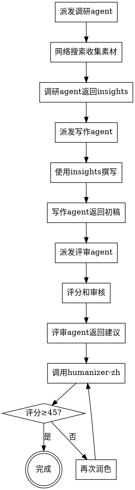

# Viral AI Blog Writing

撰写在X和微信公众号上爆火的AI技术深度博文。

## 核心特点

**自动执行的多agent workflow**：
1. 📊 调研agent - 网络搜索收集爆文模式
2. ✍️ 写作agent - 基于insights创作初稿
3. 🔍 评审agent - 独立质量评估（含humanizer-zh评分）
4. ✨ 润色阶段 - 迭代直到humanizer-zh ≥45分

**质量保证**：
- ✅ 内容质量≥70分（100分制）
- ✅ Humanizer-zh≥45分（50分制）
- ✅ 去除24种AI写作模式
- ✅ 平台适配（X + 微信）

## 使用方法

直接告诉Claude你的主题：

```
请用 viral-ai-blog-writing 撰写关于"${topic}"的博文
```

或传入参数（推荐）：

```javascript
{
  "topic": "AI Agent在代码审查中的应用",
  "target_platforms": ["X", "微信公众号"],
  "target_length": 3000
}
```

## Workflow执行流程

```
Phase 1: Research (调研)
├─ 5-8次网络搜索
├─ X平台2026爆文特点
├─ 微信公众号流行模式
└─ ${topic}最新进展和案例

Phase 2: Writing (写作)
├─ 基于research insights
├─ 内嵌humanizer-zh 24种模式规避
├─ 标题12-16词 + 2.7秒hook
└─ 2500-4000字，含代码示例

Phase 3: Review (评审)
├─ 内容质量评分（100分制）
├─ Humanizer-zh评估（50分制）
├─ 24种AI模式检测
└─ 具体改进建议

Phase 4: Polish (润色)
├─ 如果humanizer-zh <45分
├─ 迭代润色（最多3轮）
└─ 直到≥45分或达到最大轮数
```

## Humanizer-zh内化

本workflow完全内化了[Humanizer-zh](https://github.com/op7418/Humanizer-zh)的核心原则：

### 24种AI写作模式检测

**内容模式（避免）**：
- 过度强调意义："作为...的证明"、"标志着"
- -ing式分析："展现出...特征"
- 宣传语言："无缝"、"赋能"、"驱动"
- 模糊归因："专家认为"（无来源）

**语言模式（避免）**：
- AI高频词：此外、然而、至关重要、深入探讨、强调、持久的、增强、培养、获得、突出、复杂性、格局、关键性的、展示、织锦、证明、宝贵的、充满活力的
- 系动词回避：用"作为"代替"是"
- 否定排比："不仅仅是...而是..."
- 三段式法则：3项并列
- 填充短语："值得注意的是"

**风格模式（控制）**：
- 破折号过度使用
- 粗体过度使用

### 人性化写作原则

✅ **积极做到**：
1. **有观点** - 对技术做判断，不只罗列事实
2. **变化节奏** - 长短句混合
3. **第一人称** - 适当用"我"、"我们"
4. **具体细节** - 用真实数据替代抽象描述
5. **允许不完美** - 承认局限和复杂性
6. **口语化** - 像说话一样写

### 评分标准（50分制）

| 维度 | 满分 | 评估标准 |
|------|------|----------|
| 直接性 | 10分 | 直接陈述事实，无绕圈宣告 |
| 节奏 | 10分 | 句子长度变化，长短交错 |
| 信任度 | 10分 | 尊重读者智慧，不过度解释 |
| 真实性 | 10分 | 像真人说话，有个性观点 |
| 精炼度 | 10分 | 紧凑有力，无冗余赘述 |
| **及格线** | **45分** | 低于45分会自动润色 |

## 输出格式

Workflow完成后返回：

```json
{
  "article": "完整博文markdown",
  "metadata": {
    "topic": "主题",
    "phases_completed": 4,
    "research": {
      "trends_count": 5,
      "cases_count": 3
    },
    "review": {
      "content_score": 85,
      "humanizer_score": 47,
      "ai_patterns_found": ["具体发现的AI模式"]
    },
    "polish": {
      "initial_score": 42,
      "final_score": 47,
      "iterations": 2,
      "passed": true
    },
    "quality_gates": {
      "content_quality": "✅ PASS",
      "humanizer_score": "✅ PASS",
      "overall": "✅ ALL PASS"
    }
  }
}
```

## 技术实现

本skill使用Workflow tool实现，包含：
- 3个独立agent（pipeline模式）
- 强制网络搜索（Phase 1）
- 内嵌humanizer-zh逻辑（Phase 2-4）
- 自动迭代润色（直到≥45分）

代码位置：`viral-ai-blog-writing/workflow.js`

## 与传统skill的区别

| 方面 | 传统文档skill | 本workflow |
|------|---------------|------------|
| 执行方式 | 建议性，agent可忽略 | 强制执行 |
| 多agent | 无法保证 | Pipeline强制3个 |
| 网络搜索 | 依赖agent自觉 | 嵌入research agent |
| Humanizer-zh | 需单独调用 | 完全内化 |
| 评分验证 | 无 | 自动验证≥45分 |
| 质量保证 | 弱 | 双重门槛 |

## 使用示例

### 示例1: 基础使用
```
请用 viral-ai-blog-writing 撰写关于"Cursor编程实战"的博文
```

### 示例2: 带参数
```javascript
调用workflow: viral-ai-blog-writing
参数: {
  "topic": "从Claude Code看AI编程的未来",
  "target_platforms": ["X", "微信"],
  "focus": "实战经验 + 代码示例"
}
```

## 常见问题

### Q: 为什么不直接调用humanizer-zh skill？
A: Workflow tool无法在内部调用其他skill，所以我们将humanizer-zh的核心逻辑（24种模式+5维评分）完全内化到workflow中。

### Q: 评分不到45分怎么办？
A: Workflow会自动迭代润色（最多3轮），每轮针对具体AI模式进行改写。如果3轮后仍<45分，会返回当前最佳版本和警告。

### Q: 能否跳过某个阶段？
A: 不能。Workflow强制执行所有4个阶段，确保质量。

### Q: 多长时间能完成？
A: 约15-25分钟，取决于：
- Research阶段：5-8次搜索（~5分钟）
- Writing阶段：初稿创作（~5分钟）
- Review阶段：评估评分（~3分钟）
- Polish阶段：润色迭代（~5-10分钟）

## 技术要求

- Claude Code环境
- Workflow tool支持
- WebSearch tool可用
- Agent tool可用

## 版本信息

- Version: 1.0.0
- Last Updated: 2026-06-15
- Based on: Humanizer-zh (github.com/op7418/Humanizer-zh)
- License: MIT

## 贡献

发现问题或有改进建议？欢迎提issue或PR。

---

**The Bottom Line**: 这不是一个"建议性"的skill，而是一个**强制执行**的workflow。3个agent、网络调研、humanizer-zh评分，一个都不能少。


## Workflow结构



## 使用方法

**直接告诉Claude你的博文主题即可，skill会自动执行完整workflow。**

示例：
```
请用viral-ai-blog-writing skill撰写一篇关于"AI Agent在代码审查中的应用"的博文。
```

Claude会：
1. 派发调研agent进行网络搜索（5-8次搜索）
2. 派发写作agent基于insights撰写
3. 派发评审agent独立评分和审核
4. 调用humanizer-zh润色直到≥45分

## 实施要求（执行时必须遵守）

### 必须做的事（NO EXCEPTIONS）

1. **必须使用3个独立Agent**
   ```python
   # ✅ 正确 - 3个独立agent
   research_result = await Agent(research_prompt, name='researcher')
   draft = await Agent(writing_prompt, name='writer')  
   review = await Agent(review_prompt, name='reviewer')
   
   # ❌ 错误 - 单agent或少于3个
   result = await Agent("写一篇博文")  # 不可接受
   ```

2. **调研agent必须网络搜索**
   - 最少5次WebSearch
   - 覆盖：X平台特点、微信特点、主题最新进展、实战案例、成功模式

3. **必须调用humanizer-zh**
   ```python
   # ✅ 正确
   await Skill('humanizer-zh', draft)
   
   # ❌ 错误 - 跳过humanizer-zh
   # 直接返回draft
   ```

4. **评分必须≥45分**
   ```python
   while score < 45 and iterations < 3:
       draft = improve_based_on_feedback(draft, feedback)
       result = await Skill('humanizer-zh', draft)
       score = result.score
   ```

### Agent Prompts模板

**调研Agent：**
```
你是专业的AI技术调研员。

任务：调研"${topic}"相关内容：
1. X平台2026年爆火AI博文特点（标题、开头、结构、算法偏好）
2. 微信公众号AI文章流行模式（去AI味技巧、双指标管理）
3. ${topic}最新进展和热点讨论
4. 实战案例和代码示例来源
5. 成功案例共同模式

要求：
- 使用WebSearch至少5-8次
- 返回结构化insights（JSON）

输出结构：
{
  "x_platform": {
    "title_formulas": [],
    "hook_techniques": [],
    "algorithm_preferences": {}
  },
  "wechat": {
    "popular_patterns": [],
    "deai_techniques": []
  },
  "topic_insights": {
    "latest_trends": [],
    "case_studies": [],
    "code_examples": []
  }
}
```

**写作Agent：**
```
你是专业的AI技术博主。

任务：基于调研insights撰写博文。

Insights:
${JSON.stringify(research_insights)}

主题：${topic}

要求：
1. 标题：12-16词，包含数字/动词/痛点
2. 开头：2.7秒hook（问题/好奇/痛点）
3. 结构：问题→重要性→局限→方法→案例→影响→行动
4. 代码：可运行、有注释、解释WHY
5. 长度：2500-4000字
6. 语气：对话式专业，避免AI腔

输出：完整markdown博文
```

**评审Agent：**
```
你是严格的技术博文评审员。

博文：
${draft}

评审维度（100分制）：
- 标题吸引力（10分）
- Hook效果（15分）
- 技术深度（20分）
- 实战价值（20分）
- 代码质量（15分）
- 可读性（10分）
- 平台适配（10分）

要求：
- 低于70分不合格
- 指出具体问题
- 给出可执行建议
- 严格评分，不放水

输出：
{
  "score": number,
  "breakdown": {...},
  "weaknesses": [...],
  "suggestions": [...]
}
```

## 调研要点（来自网络调研总结）

### X平台特点（2026）
- Front-loaded and concise（前置重点）
- Sharp, purposeful（一针见血）
- Breaking News模板很有效
- Thread格式仍然流行
- 7-9 PM EST黄金时间
- 2-3个trending hashtags
- 认证账号优先

### 微信公众号特点（2026）
- **核心挑战：AI检测限流**
- 去AI味（de-AI-ification）关键
- 工作流优化（2分钟初稿+润色）
- 双指标管理（查重+AIGC率）

### 技术博文Hook技巧
1. 从问题开始
2. 制造好奇和张力
3. 承诺收益或痛点
4. 2.7秒规则
5. 避免定义式开头

### 标题公式
- 10-18词最佳
- 12-16词CTR高37%
- 包含数字、动词、痛点

### 内容结构
1. Hook开头（2.7秒内）
2. 问题陈述
3. 为什么重要
4. 现有局限
5. 你的方法
6. 实战案例
7. 结果影响
8. 行动号召

### 代码示例要求
- 一个优秀例子胜过多个平庸例子
- 可运行
- 有注释
- 解释WHY不只是HOW
- 来自真实场景

## 反Rationalization表

| Rationalization | 现实 |
|---|---|
| "我可以一个agent完成所有工作" | 单一agent既写又审容易宽松，缺乏客观性 |
| "不需要调研，我已经了解" | 平台特点和算法在变，必须基于2026最新数据 |
| "44分也差不多了" | 要求是≥45分，差1分也是不达标 |
| "润色一次就够了" | 可能需要2-3轮才能达标，这是正常的 |
| "评审太严格了" | 严格评审才能保证质量，宽松评审是自欺欺人 |
| "可以边写边调研" | 调研和写作必须分离，保证信息完整性 |
| "humanizer-zh可以最后再说" | 必须验证评分，这是质量门槛 |

## Red Flags - 停下来重新开始

- 只用一个agent完成所有工作
- 没有进行网络搜索
- 没有调用humanizer-zh
- 评分<45但不重新润色
- 写作agent同时做评审
- 跳过调研直接写作

## 输出格式

完成后输出：

```markdown
# 博文标题

[博文正文...]

---

## 创作过程

- 调研agent：完成8次网络搜索
- 写作agent：基于insights创作初稿
- 评审agent：评分${reviewScore}/100，提出${suggestionCount}条建议
- humanizer-zh：初始${initialScore}分 → 最终${finalScore}分
- 迭代轮数：${iterations}轮

## 质量指标

- 技术深度：✅ 
- 实战价值：✅
- humanizer-zh：${finalScore}/45 ✅
- 平台适配：X ✅ / 微信 ✅
```

## 常见错误

### ❌ 错误1：用brainstorming skill
**问题**：brainstorming是软件设计workflow，不是内容创作workflow  
**正确**：使用本skill的多agent协作workflow

### ❌ 错误2：单agent包揽
**问题**：一个agent完成调研、写作、评审  
**正确**：3个独立agent，每个专注自己的职责

### ❌ 错误3：忽略评分
**问题**：humanizer-zh评分42分就交付了  
**正确**：必须≥45分，<45时重新润色

### ❌ 错误4：跳过调研
**问题**："我知道怎么写"直接开始  
**正确**：必须网络搜索收集2026最新平台特点

## 实战案例

（待第一次成功使用后补充真实案例）

## The Bottom Line

**Viral AI Blog Writing = 多agent协作 + 网络调研 + humanizer-zh验证**

- 3个agent，不可减少
- 网络搜索，不可跳过
- 45分门槛，不可妥协

如果你发现自己在rationalize为什么可以"简化"这个流程，停下来，重新阅读本skill。
